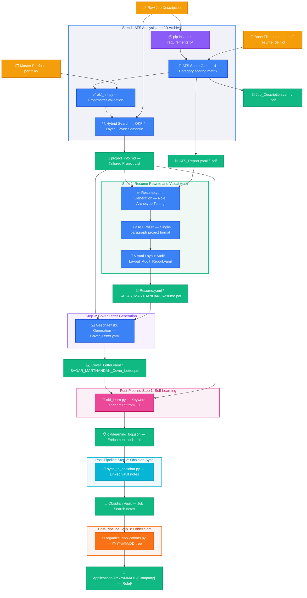

[//]: # (DEVELOPER DOCUMENTATION ONLY — not part of agent runtime context. Do not read this file during pipeline execution.)
# 📄 Premium YAML-CV Resume & Cover Letter Tailoring Pipeline

An end-to-end, high-scannability, and ATS-optimized application materials generation pipeline. It uses structured YAML files for configuration, compiles them to PDF/LaTeX, and leverages Google OKF (Open Knowledge Format) matching to dynamically rank and inject relevant engineering projects from a master portfolio directory based on a target Job Description (JD).

---

## 🗺️ Architectural Workflow

The following diagram illustrates the data flow, offline semantic search, and the three-stage generation lifecycle:



---

## 🛠️ Step-by-Step Execution Guide

The entire process is organized into 3 primary sequential steps, executed automatically by the agent when you supply a Job Description, followed by three post-pipeline steps (self-learning enrichment, Obsidian vault sync, and folder sorting):

### STEP 1: Setup, ATS Analysis & Job Description Archival
- **Name the Session (First Action):** Before any pipeline work, extract the Company Name and Job Role from the JD and rename the agent session/conversation to `[Company Name] — [Job Role]` in the UI sidebar. This makes it easy to identify which agent is handling which application when running multiple agents in parallel.
- **Dependency Ingest:** Automatically installs/updates pip dependencies (`pyyaml`, `reportlab`, `pypdf`) using Python 3.12.
- **Language Detection:** Identifies whether the JD is in English or German and loads corresponding base resume files.
- **ATS Pre-Scoring:** Grades the base resume against a calibrated 4-category German-market matrix (max 100 points).
  - **Score Gate:** If the ATS score is `< 85`, the pipeline triggers a `HOLD` verdict, presenting specific remedy suggestions (e.g., missing keywords, project mismatches). If `>= 85`, it sets `PROCEED`.
- **Frontmatter Lint:** Runs `okf_lint.py` to validate all portfolio files have clean YAML frontmatter (non-empty fields, canonical archetypes, no denylisted tech tokens, keyword quality checks). Fails before scoring if any violation is found.
- **Hybrid Project Selector:** Programmatically searches the local portfolio using a hybrid search engine ([zvec_hybrid_search.py](zvec_hybrid_search.py)) that combines OKF 4-layer phrase matching (exact, synonym, stemming, fuzzy) with Zvec semantic embeddings (all-MiniLM-L6-v2), archetype-boosted scoring (+10 primary, +5 secondary from `ATS_Report.yaml`), and Jaccard-style normalization. Score fusion: `final = (okf * 0.6) + (zvec * 0.4)`. Writes the top matching projects to a tailored `project_info.md` file with full hybrid diagnostics (OKF score, Zvec cosine, fused score).
- **Location Tailoring:** Extracts the job location from the job description and uses web search to determine the closest candidate location among Kiel (home), Frankfurt (friend), Berlin (friend), and Köln (friend).
- **Outputs:** `ATS_Report.yaml` & `Job_Description.yaml` (plus their compiled `.pdf` documents) and the tailored `project_info.md`.
- **Naming Convention (Critical):** The application folder and session name MUST be `[Company Name] — [Job Role]` extracted directly from the JD content. No arbitrary names, timestamps, or placeholders. This makes it easy to identify which session is running which application when multiple agents run in parallel.

### STEP 2: Resume Rewrite & Visual Layout Audit
- **Tuned Resume Generation:** Writes `Resume.yaml` by tailoring descriptions, skills, and summary to align with the target role archetype and the retrieved local projects, and sets the contact location to the computed closest candidate city.
- **LaTeX Compilation & Project Format Polish:** Generates a professional LaTeX resume (`SAGAR_MARTHANDAN_Resume.tex` or `SAGAR_MARTHANDAN_Lebenslauf.tex` for German) and converts project listings from standard bullet points into a compact, single-paragraph prose block with tools woven in naturally.
- **Uniform Spacing:** All project and experience entries are separated by a consistent `\vspace{6pt}` — no double-spacing, no variable gaps.
- **Constraints & Eye-Test Audit:** Runs character-length audits:
  - Experience bullets: Must be strictly single-line and `<= 105` characters.
  - Project paragraphs: Must be `<= 300` characters total (`<= 250` characters for German projects) and fit within `<= 3` lines.
  - Summary: Exactly 4 lines of text, maximum 420 characters (maximum 380 characters for German Zusammenfassung).
  - Stop-Slop writing rules: Strict active voice, no `-ly` adverbs, zero em-dashes, no filler text.
- **Self-Correction:** Resolves any line-wraps or overflows dynamically.
- **Post-Rewrite ATS Rescoring:** Updates `post_rewrite_ats_score` in `ATS_Report.yaml` and recompiles `ATS_Report.pdf`.
- **Outputs:** `Resume.yaml`, `SAGAR_MARTHANDAN_Resume.pdf` / `SAGAR_MARTHANDAN_Lebenslauf.pdf` (along with preserved LaTeX `.tex` sources), `Layout_Audit_Report.yaml`, and the post-rewrite ATS rescoring results updated inside `ATS_Report.yaml`.

### STEP 3: Cover Letter Generation
- **Geschäftsbrief Layout:** Generates a metric-grounded cover letter adapted to formal German business formatting, set to the computed closest candidate location (both in the sender address and date/city header).
- **Strict Limits:** Restricts cover letter content to exactly one page, 4 paragraphs, and **250–320 words** total (restricted to **180–240 words** for German cover letters to prevent A4 overflow).
- **Outputs:** `Cover_Letter.yaml` and compiled `SAGAR_MARTHANDAN_Cover_Letter.pdf` / `SAGAR_MARTHANDAN_Anschreiben.pdf` (along with preserved LaTeX `.tex` sources).

### Post-Pipeline Step 1: Self-Learning Keyword Enrichment
- **Keyword Learning:** After the cover letter compiles, [okf_learn.py](okf_learn.py) extracts domain-relevant terms from the processed Job Description, finds terms that appear in matched projects' bodies but are missing from their keyword lists, and appends them.
- **Safeguards:** Max 3 new keywords per project per run, 15 keywords per file max (linter enforced with rollback), every change logged to `okf/learning_log.json` with timestamp and JD source.
- **Idempotent:** Re-running on the same application folder is a no-op (no duplicate keywords added).

### Post-Pipeline Step 2: Obsidian Vault Sync
- **Graph-View Navigation:** After the learning loop, [sync_to_obsidian.py](sync_to_obsidian.py) walks the entire `Applications/` tree and generates linked Obsidian notes under `<vault>/Job Search/`.
- **Note Types:** One note per application, company, role archetype, skill, and project. Wikilinks connect applications to companies, roles, skills, and projects for graph-view navigation.
- **Format Support:** Handles both YAML and MD application formats automatically.
- **Standalone Use:** Run `python sync_to_obsidian.py` to sync all applications, or use `--dry-run` to preview without writing.

### Post-Pipeline Step 3: Application Folder Sorting
- **Prerequisite:** Obsidian sync (Step 2) MUST complete successfully before this step. Do NOT run `organize_applications.py` until `sync_to_obsidian.py` has finished — the folder must remain at `Applications/[Company Name] — [Job Role]/` during sync so the sync script can find it.
- **Date-Organized Tree:** After Obsidian sync succeeds, [organize_applications.py](organize_applications.py) moves the just-created application folder into `Applications/YYYY/MM/DD/[Company Name] — [Job Role]/`, bucketed by the folder's creation time.
- **Idempotent:** Re-running the script is a no-op on already-sorted folders.
- **Standalone Use:** Run `python organize_applications.py` to sort all existing unsorted folders in `Applications/`, or `python organize_applications.py "Applications/[Company] — [Role]"` to sort a single folder. Use `--dry-run` to preview moves without applying them.

---

## 💾 Hybrid Search Architecture (OKF + Zvec)

The portfolio search runs **100% locally and offline** using a hybrid approach that combines Google's **Open Knowledge Format (OKF)** phrase matching with **Zvec semantic embeddings** for score fusion:

- **Hybrid Search Engine:** [zvec_hybrid_search.py](zvec_hybrid_search.py) runs both OKF and Zvec search, then fuses scores: `final = (okf_score * 0.6) + (zvec_sim * 0.4)`. OKF provides precision for exact/synonym/stem/fuzzy matches. Zvec provides semantic recall for conceptual matches OKF can't see (e.g., "event streaming platform" → Kafka project).
- **OKF Bundle Structure:** The master portfolio is structured as a directory of modular Markdown files under `okf/portfolio/`, each carrying metadata in its YAML frontmatter block (e.g., `title`, `description`, `technologies`, `keywords`, and `archetypes`).
- **OKF Matching Algorithm (4-layer):** The OKF component ([okf_portfolio_search.py](okf_portfolio_search.py)) uses a 4-layer matching strategy:
  1. **Exact phrase matching** — multi-word phrases as substrings, single words with word boundaries (no false positives from token splitting)
  2. **Synonym/alias expansion** — bidirectional map of 50+ domain terms (e.g., `kafka` ↔ `message queue`, `dbt` ↔ `transformation framework`, `terraform` ↔ `infrastructure as code`, `rag` ↔ `retrieval augmented generation`)
  3. **Light stemming** — strips common English suffixes (`-tion`, `-ing`, `-er`, `-ed`, `-es`, `-s`) for morphological variant matching (`orchestration` ↔ `orchestrator`, `pipeline` ↔ `pipelines`)
  4. **Fuzzy token matching** — `difflib.SequenceMatcher` with 0.85 ratio threshold for typo tolerance (`Databrick` → `Databricks`, `kuberntes` → `kubernetes`)
- **OKF Scoring:** Jaccard-style normalization prevents JD-length bias. Archetype boosts (+10 primary, +5 secondary) are applied when `ATS_Report.yaml` is provided. Tiebreaker: archetype match count, then tech match count, then alphabetical. Configurable `top_k` via CLI argument (default 4).
- **Zvec Semantic Layer:** All 14 portfolio files are embedded using `all-MiniLM-L6-v2` (384-dim vectors) and stored in a local Zvec database under `okf/zvec_db/`. Incremental re-embedding via content hash detection — only changed files are re-embedded. When `okf_learn.py` adds new keywords, modified files are automatically re-embedded into the Zvec database.
- **Score Fusion:** Zvec cosine similarity (0-1) is scaled to the OKF score range, then weighted: `final = (okf_score * 0.6) + (zvec_scaled * 0.4)`. Weights are configurable in `config.py` (`HYBRID_OKF_WEIGHT`, `HYBRID_ZVEC_WEIGHT`).
- **Cross-Process Safety:** All Zvec DB operations (ingestion, query, re-embed) are protected by a cross-process file lock (`zvec_db_lock()`). Uses OS-level locking (`msvcrt` on Windows, `fcntl` on Unix) with infinite wait (no timeout) and 0.5s retry interval. Agents wait indefinitely until the lock is released — no chance of concurrent access errors. CPU-bound work (embedding computation, hash detection) runs outside the lock to minimize hold time.
- **Frontmatter Linter:** [okf_lint.py](okf_lint.py) validates all portfolio files before scoring: checks for non-empty fields, canonical archetypes, denylisted tech tokens, description length, keyword count, and title-token overlap. Fails loud with the offending file + field.
- **Self-Learning Loop:** [okf_learn.py](okf_learn.py) runs post-application to enrich portfolio keywords from real JDs. Extracts domain-relevant terms, finds them in matched projects' bodies, and appends as new keywords. Max 3 per project per run, 15 per file cap, linter-validated with rollback, full audit trail in `okf/learning_log.json`.
- **Obsidian Vault Sync:** [sync_to_obsidian.py](sync_to_obsidian.py) syncs all applications to the Obsidian vault as linked notes (applications, companies, roles, skills, projects) for graph-view navigation and knowledge management.
- **Distilled Output:** The top matched projects are written to `project_info.md` as compact summaries (title + description + tech + archetypes + body summary + match diagnostics comment) for use in Step 2.

---

## 📂 Project Directory Structure

```
YAML-CV/
├── skills\
│   └── okf-cv\
│       ├── SKILL.md                      # Agent-facing skill metadata
│       ├── README.md                     # This file (developer documentation)
│       ├── OKF_IMPROVEMENT_PLAN.md       # OKF improvement plan & Phase 6 design
│       ├── 01_ats_and_jd_archival.md     # Step 1 detailed agent rules
│       ├── 02_resume_and_visual_audit.md # Step 2 detailed agent rules
│       ├── 03_cover_letter.md            # Step 3 detailed agent rules
│       ├── requirements.txt              # Pipeline dependencies (pyyaml, reportlab, pypdf)
│       ├── config.py                     # Centralized paths and constants
│       ├── yaml_to_pdf.py                # Main YAML compilation router
│       ├── zvec_hybrid_search.py       # Hybrid search (OKF phrase matching + Zvec semantic embeddings, score fusion)
│       ├── okf_portfolio_search.py       # OKF search engine (4-layer matching, archetype boost, Jaccard normalization) — fallback if Zvec unavailable
│       ├── okf_lint.py                   # Frontmatter linter for portfolio files
│       ├── okf_learn.py                  # Self-learning keyword enrichment (post-application)
│       ├── sync_to_obsidian.py           # Syncs applications to Obsidian vault as linked notes
│       ├── organize_applications.py      # Sorts application folders into YYYY/MM/DD tree (post-pipeline)
│       ├── okf/                          # Self-contained OKF Knowledge Base
│       │   ├── portfolio/                # 14 individual OKF project markdown files
│       │   ├── zvec_db/                  # Zvec vector database (auto-generated, hash-indexed for incremental re-embedding)
│       │   ├── base_files/
│       │   │   ├── english/              # English base resume.md
│       │   │   └── german/               # German base resume_de.md
│       │   ├── photo/                    # Sagar.jpg for LaTeX templates
│       │   └── learning_log.json         # Self-learning enrichment audit trail
│       ├── renderers\                    # LaTeX/ReportLab rendering handlers
│       │   ├── utils.py                  # Shared utilities (escape_latex, fonts, run_pdflatex)
│       │   ├── resume.py                 # Resume renderer (LaTeX primary, ReportLab fallback)
│       │   ├── cover_letter.py           # Cover Letter renderer (LaTeX primary, ReportLab fallback)
│       │   ├── job_description.py        # Job Description renderer (ReportLab only)
│       │   └── ats_report.py             # ATS Report renderer (ReportLab only)
│       └── tests/
│           ├── test_utils.py             # Unit tests for LaTeX escaping and formatting
│           └── test_okf_search.py        # Automated test suite for OKF search
└── Applications\
    └── YYYY\
        └── MM\
            └── DD\
                └── [Company Name] — [Job Role]\      # Application folder (sorted by creation date)
                    ├── Job_Description.yaml / .pdf
                    ├── ATS_Report.yaml / .pdf
                    ├── project_info.md               # Tailored & distilled project list
                    ├── Resume.yaml / Layout_Audit_Report.yaml / Cover_Letter.yaml
                    ├── SAGAR_MARTHANDAN_Resume.pdf / .tex  (or Lebenslauf.pdf / .tex for German)
                    └── SAGAR_MARTHANDAN_Cover_Letter.pdf / .tex  (or Anschreiben.pdf / .tex for German)
```

---

## 🚀 How to Run the Pipeline

Since all the pipeline steps are natively codified into the agent's custom skills directory, you do not need to copy-paste any external prompts.

To execute the pipeline:
1. Paste the target **Job Description** (JD) into the chat.
2. Type: **`execute yaml-cv-pipeline`** (or keywords like *"tailor resume"* / *"optimize resume"*).
3. The agent will automatically run the end-to-end flow: installing dependencies, linting portfolio frontmatter, searching matching projects using hybrid search (OKF phrase matching + Zvec semantic embeddings with score fusion), compiling the ATS reports, writing the final tailored files to the `Applications/` directory, enriching portfolio keywords via the self-learning loop (with automatic Zvec re-embedding), syncing to the Obsidian vault, and sorting the application folder into the `Applications/YYYY/MM/DD/` date tree.

---

## 🧪 Testing

Run the automated test suite to verify search relevance:
```powershell
cd "[skill directory]"
C:\Users\sagar\AppData\Local\Programs\Python\Python312\python.exe tests\test_okf_search.py
```

The suite includes 3 test cases:
1. **Data Engineering search** with archetype boost — verifies DE projects rank in top-3
2. **AI/RAG Developer search** with dual archetype — verifies RAG project ranks #1
3. **Smoke test** with generic DE JD — verifies at least 2 expected DE projects appear in top-3

Run the hybrid search standalone (OKF + Zvec score fusion):
```powershell
C:\Users\sagar\AppData\Local\Programs\Python\Python312\python.exe zvec_hybrid_search.py "Job_Description.yaml" "project_info.md" "ATS_Report.yaml"
```

Run the frontmatter linter standalone:
```powershell
C:\Users\sagar\AppData\Local\Programs\Python\Python312\python.exe okf_lint.py
```

Run the self-learning loop standalone:
```powershell
C:\Users\sagar\AppData\Local\Programs\Python\Python312\python.exe okf_learn.py "Applications/[Company Name] — [Job Role]"
```

Sync applications to Obsidian vault:
```powershell
C:\Users\sagar\AppData\Local\Programs\Python\Python312\python.exe sync_to_obsidian.py
```

---

## 📋 Changelog

### v23 — Hybrid Search Mode (OKF + Zvec Score Fusion)
**Files:** `zvec_hybrid_search.py` (new), `config.py`, `okf_learn.py`, `01_ats_and_jd_archival.md`, `SKILL.md`, `README.md`

- **Created `zvec_hybrid_search.py`:** Hybrid search engine that runs both OKF phrase matching and Zvec semantic embeddings, then fuses scores: `final = (okf_score * 0.6) + (zvec_sim * 0.4)`.
- **Zvec semantic layer:** All 14 portfolio files embedded using `all-MiniLM-L6-v2` (384-dim vectors) stored in local Zvec database under `okf/zvec_db/`.
- **Incremental re-embedding:** Content hash detection (`hash_index.json`) ensures only modified files are re-embedded. Full re-embedding only on first run or `force_recreate`.
- **Re-embed trigger in `okf_learn.py`:** When the self-learning loop adds new keywords to a portfolio file, the modified file is automatically re-embedded into the Zvec database via `reembed_file()`. Non-blocking — fails gracefully if Zvec unavailable.
- **Score fusion:** Zvec cosine similarity (0-1) scaled to OKF score range, then weighted. Weights configurable in `config.py` (`HYBRID_OKF_WEIGHT=0.6`, `HYBRID_ZVEC_WEIGHT=0.4`).
- **Hybrid diagnostics:** `project_info.md` now shows both OKF and Zvec scores in the match diagnostics comment: `OKF=X.XX, Zvec=0.XXX, fused=X.XX`.
- **Updated `01_ats_and_jd_archival.md`:** Step 1 now uses `zvec_hybrid_search.py` instead of `okf_portfolio_search.py` for project search.
- **Updated `SKILL.md`:** Pipeline diagram, script listing, and dependencies updated to include hybrid search and Zvec dependencies.
- **Updated `config.py`:** Added `ZVEC_DB_PATH`, `EMBEDDING_MODEL_NAME`, `EMBEDDING_DIMENSION`, `HYBRID_OKF_WEIGHT`, `HYBRID_ZVEC_WEIGHT` with env var override support.
- **Cross-process locking:** All Zvec DB operations wrapped in `zvec_db_lock()` context manager using OS-level file locking (`msvcrt` on Windows, `fcntl` on Unix). Infinite wait (no timeout) — agents wait indefinitely until the lock is released. 0.5s retry interval. CPU-bound work (embeddings, hashing) runs outside the lock to minimize contention. Enables safe parallel pipeline execution across multiple agents.
- **OKF fallback:** `okf_portfolio_search.py` remains as a fallback if Zvec/sentence-transformers are not installed.

---

### v22 — OKF Improvement Plan: Frontmatter Curation, Scoring Rewrite, Linter & Self-Learning
**Files:** All 14 `okf/portfolio/*.md` files, `okf_portfolio_search.py`, `okf_lint.py` (new), `okf_learn.py` (new), `sync_to_obsidian.py`, `01_ats_and_jd_archival.md`, `03_cover_letter.md`, `tests/test_okf_search.py`, `SKILL.md`, `README.md`

**Phase 1 — Frontmatter Curation:**
- Audited and rewrote frontmatter for all 14 portfolio files using `repo info.md` as source of truth.
- Replaced broken image alt-text in descriptions with concise 1-sentence summaries.
- Removed noise tokens from technologies (`2025`, `ER Diagram`, `Project Status:`, `Screenshot 1`, etc.).
- Replaced title-derived keyword tokens with domain-relevant phrases.
- Trimmed archetypes from 7+ tags per file to 1-2 accurate canonical archetypes.
- Added Analytics Engineering archetype to NYC Taxi, Weather Data, and YouTube E2E projects.
- Added Data Analyst archetype to COMAD PCA project (anomaly detection, exploratory analysis).

**Phase 2 — Scoring Algorithm Rewrite:**
- Replaced token-intersection with phrase-level matching (multi-word phrases as substrings, single words with word boundaries).
- Added bidirectional synonym/alias map (50+ entries covering DE/AI domain: kafka↔message queue, dbt↔transformation framework, terraform↔iac, rag↔retrieval augmented generation, etc.).
- Added light stemming for morphological variants (orchestration↔orchestrator, pipeline↔pipelines).
- Added fuzzy token matching via `difflib.SequenceMatcher` (threshold 0.85) for typo tolerance.
- Added archetype boost: +10 for primary, +5 for secondary (from `ATS_Report.yaml`), +3 fallback from raw JD text.
- Added Jaccard-style normalization to prevent JD-length bias.
- Improved tiebreaker: archetype match count, then tech match count, then alphabetical.
- Added configurable `top_k` CLI argument (default 4).
- Search command now accepts `ATS_Report.yaml` as 3rd argument for archetype-boosted scoring.

**Phase 3 — Distill Output Enrichment:**
- `distill_project()` now emits archetypes line, body summary (first 1-2 sentences), and match diagnostics HTML comment.

**Phase 4 — Validation & Guardrails:**
- Created `okf_lint.py` frontmatter linter: validates non-empty fields, canonical archetypes, denylisted tech tokens, description length, keyword count, title-token overlap.
- Added linter step to Step 1 pipeline in `01_ats_and_jd_archival.md`.
- Updated `tests/test_okf_search.py` with 3 test cases: DE with archetype boost, AI/RAG with dual archetype, smoke test with generic JD.

**Phase 5 — Dependency & Config Cleanup:**
- Verified `requirements.txt` is minimal (`pyyaml`, `reportlab`, `pypdf`). No changes needed.

**Phase 6 — Self-Learning Keyword Enrichment:**
- Created `okf_learn.py`: post-application keyword enrichment loop.
- Extracts domain-relevant terms (bigrams/trigrams + single tokens) from processed JD using 100+ regex patterns.
- For each matched project, finds JD terms in project body/description/technologies but missing from keywords.
- Filters out 300+ generic noise words to ensure only domain-relevant terms are added.
- Appends up to 3 new keywords per project per run, respects 15-keyword cap.
- Runs linter after enrichment with baseline comparison; rolls back only on new violations.
- Logs all changes to `okf/learning_log.json` with timestamp, JD source, and role archetype.
- Wired into pipeline as Post-Pipeline Step 1 (after cover letter, before folder sort).
- Updated `03_cover_letter.md`, `SKILL.md`, and `README.md` with learning loop integration.

**Obsidian Vault Sync Integration:**
- Wired `sync_to_obsidian.py` into pipeline as Post-Pipeline Step 2 (after learning loop, before folder sort).
- Syncs all applications to Obsidian vault as linked notes (applications, companies, roles, skills, projects) for graph-view navigation.
- Handles both YAML and MD application formats.
- Updated `03_cover_letter.md`, `SKILL.md`, and `README.md` with Obsidian sync step.

---

### v21 — Google OKF Portfolio Search Migration
**Files:** `okf_portfolio_search.py` (new), `config.py`, `requirements.txt`, `renderers/job_description.py`, `renderers/ats_report.py`, `renderers/utils.py`, `01_ats_and_jd_archival.md`, `02_resume_and_visual_audit.md`, `03_cover_letter.md`, `SKILL.md`, `README.md`, `tests/test_okf_search.py` (new)

**Architectural Migration:**
- Replaced vector-based search engine with **Google OKF (Open Knowledge Format)** search matching — 100% local, offline, deterministic.
- Restructured candidate portfolio from a flat `repo info.md` file to a modular, self-contained `okf/` folder inside the skill directory. Contains individual project markdown files with metadata frontmatters (specifying keywords, technologies, and archetypes) and template base resumes/photos.
- Created `okf_portfolio_search.py` to calculate deterministic keyword/archetype overlap scores between the job description and project files.

**Resource and Dependency Gains:**
- Removed heavy Python ML dependencies (`torch`, `sentence-transformers`, `tqdm`) saving **~2.5GB of disk space** and reducing memory footprint from **~1GB to <15MB**.
- Search execution speed increased **100x** (from ~3s model load time to <5ms query execution).

**ReportLab Fallback Typeface Integration:**
- Swapped ReportLab fallback PDF fonts (in `ats_report.py` and `job_description.py`) from Calibri to **Latin Modern Roman 10** (`LMRoman10`) using the centralized font helper.

---

### v20 — Application Folder Date-Tree Sorting
**Files:** `organize_applications.py` (new), `03_cover_letter.md`, `SKILL.md`, `README.md`

- **Added `organize_applications.py`** — sorts application folders into a `Applications/YYYY/MM/DD/[Company Name] — [Job Role]/` tree, bucketed by each folder's creation time (`os.path.getctime`).
- **Two run modes:** scan mode (sorts every unsorted folder in `Applications/`) and targeted mode (sorts a single freshly-created folder, used by the pipeline).
- **Pipeline integration:** Step 3 now runs the sorter automatically after the cover letter compiles, placing the new application folder into the correct date bucket.
- **Idempotent and safe:** already-sorted folders are skipped; `--dry-run` previews moves; `--root` overrides the Applications path for isolated testing; UTF-8 stdout reconfigure handles em-dash (`—`) folder names on the Windows console.

---

### v19 — ATS Scoring Remodel & Font Update
**Files:** `renderers/utils.py`, `renderers/ats_report.py`, `renderers/job_description.py`, `01_ats_and_jd_archival.md`, `02_resume_and_visual_audit.md`, `README.md`

- **Removed `formatting_and_parse` from the ATS score matrix.** Formatting no longer dilutes the 100-point score.
- **Rebalanced the matrix to 4 equally-weighted categories of 25 points each:** `keywords_and_terminology`, `experience_relevance`, `technical_skills`, `soft_skills_and_language` (total = 100).
- **Added a non-scored `formatting_quality` verdict** (`Excellent` / `Good` / `Average` / `Bad`) with `suggestions` populated only when the verdict is `Average` or `Bad`. Rendered as a dedicated section in the ATS Report PDF (pre- and post-rewrite).
- **Fixed unformatted dict rendering** in the ATS Report PDF: `bullet_point_density_audit` and `quantified_outcomes` entries are now rendered as readable labeled lines instead of raw Python dict reprs.
- **Switched the ATS Report and Job Description PDF typeface** to Latin Modern Roman 10 (`LMRoman10`) with Helvetica fallback.

---

### v18 — Replace closest_location.py with LLM Web Search
**Files:** `closest_location.py` (deleted), `tests/test_closest_location.py` (deleted), `config.py`, `01_ats_and_jd_archival.md`, `SKILL.md`, `README.md`

- Removed `closest_location.py` and its unit tests — the hardcoded city coordinate database and haversine distance calculation failed for remote locations and any city not in the static database.
- Removed `CANDIDATES` and `CITY_COORDS` dictionaries from `config.py`.
- Step 1 now instructs the LLM to **web search** which of the 4 candidate cities (Kiel, Frankfurt, Berlin, Köln) is geographically nearest to the job location.
- Remote, country-wide, or unspecified locations still default to Kiel, Germany.

---

### v17 — Scope Leak Fixes & Portability Improvements
**Files:** `config.py`, `01_ats_and_jd_archival.md`, `02_resume_and_visual_audit.md`, `03_cover_letter.md`, `renderers/utils.py`, `SKILL.md`, `README.md`

**Scope Leak Fixes:**
- Made all Base Files paths relative and configurable via environment variables (`YAML_CV_MD_PATH`, `YAML_CV_DB_PATH`)
- Replaced hardcoded Python interpreter paths with `python` to support local/venv installations
- Restricted font search to local directories only (`project/fonts/`, `../Base Files/fonts/`) with `YAML_CV_FONT_DIRS` override
- Updated all working directory references from absolute paths to relative `Applications/`
- Fixed photo path references to use relative paths

**Portability:**
- Skill now operates entirely within its scope without accessing files outside the project
- Supports locally installed dependencies without requiring specific Python installation paths
- Environment variable overrides for all critical paths for maximum flexibility

---

### v16 — Performance & Code Quality Optimizations
**Files:** `renderers/utils.py`, `renderers/cover_letter.py`, `yaml_to_pdf.py`, `config.py`, `requirements.txt`, `test_utils.py`

**Code Quality & Maintainability:**
- Created centralized `config.py` for all hardcoded paths, constants, and city coordinates with environment variable override support
- Consolidated duplicate font registration code into `_find_and_register_font_family()` helper function (~60 lines reduced)
- Extracted common address formatting utility `format_address()` for LaTeX/HTML rendering
- Added comprehensive type hints to all functions in `renderers/utils.py` and `yaml_to_pdf.py`

**Testing:**
- Created `test_utils.py` with 30 unit tests for LaTeX escaping and address formatting utilities

---

### v14 — LM Roman 10 Font Integration
**Files:** `renderers/utils.py`, `renderers/ats_report.py`, `renderers/job_description.py`, `README.md`

- Replaced previous font with Latin Modern Roman 10 (`LMRoman10`) for the ReportLab-based Job Description archival and ATS Report PDFs.
- Added TTF registration code for `lmroman10` (regular, bold, italic, bold-italic) searching standard system and local AppData paths.

---

### v13 — Job Location Tailoring
**Files:** `SKILL.md`, `01_ats_and_jd_archival.md`, `02_resume_and_visual_audit.md`, `03_cover_letter.md`, `README.md`

- Introduced a location-tailoring mechanism that extracts the job location from the job description.
- Uses web search to determine the closest candidate city among Kiel (home), Frankfurt (friend), Berlin (friend), and Köln (friend).
- Updated pipeline steps to propagate the closest candidate city to `Resume.yaml` and `Cover_Letter.yaml` addresses and dates.

---

### v12 — Pipeline Token Optimizations
**Files:** `01_ats_and_jd_archival.md`, `02_resume_and_visual_audit.md`, `03_cover_letter.md`, `SKILL.md`, `README.md`, `renderers/utils.py`, `renderers/ats_report.py`, `renderers/job_description.py`

- Collapsed writing style guidelines and step descriptions to reference-only summaries, saving context tokens and preventing documentation drift.
- Replaced copy-paste attachment placeholders with direct file load instructions, saving **1,000–3,000+ context tokens** per run.
- Added developer-only skip comment to the top of `README.md`.

---

### v11 — YAML Frontmatter Syntax Fix
**Files:** `SKILL.md`

- Converted the description in `SKILL.md` frontmatter to use a YAML block scalar (`>-`).
- Resolves parsing errors where unescaped colons and quotes within the description caused invalid YAML syntax.

---

### v10 — ReportLab Only for Job Description Archival
**Files:** `renderers/job_description.py`, `SKILL.md`

- Changed the Job Description compiler to output directly in ReportLab fallback mode (no LaTeX conversion or pdflatex compiling).
- Streamlined `create_job_description_pdf` to call the fallback generator directly.

---

### v9 — ReportLab Only for ATS Analysis
**Files:** `renderers/ats_report.py`, `SKILL.md`

- Changed the ATS Analysis report compiler to output directly in ReportLab fallback mode (no LaTeX conversion or pdflatex compiling).
- Streamlined `create_ats_report_pdf` to call the fallback generator directly.

---

### v8 — LaTeX Paragraph Separation Fix
**Files:** `renderers/resume.py`, `02_resume_and_visual_audit.md`

- Fixed projects (and experience entries) flowing together as one continuous block of text with no visual gap between them.
- **Root cause:** `\vspace{6pt}` between `\noindent` paragraphs was firing in LaTeX's horizontal mode (mid-paragraph) where it is a no-op. LaTeX must be in vertical mode for `\vspace` to produce actual vertical space.
- **Fix:** Added `\par` at the end of each `\end{itemize}` block in the generator (`resume.py`). `\par` explicitly ends the paragraph and switches LaTeX to vertical mode before the `\vspace{6pt}` separator fires.
- Updated `02_resume_and_visual_audit.md` Step 4 format rule to require `.\par` at the end of every project paragraph in the LaTeX polish step.

---

### v6 — README Changelog & Mermaid Diagram Fix
**Files:** `README.md`

- Added full `## Changelog` section to `README.md` documenting all changes from v1–v5 with files affected, rationale, and bullet-point summaries.
- Fixed Mermaid architectural diagram for GitHub compatibility:
  - Replaced `&` with `and` in all node labels and subgraph titles.
  - Split multi-source arrow syntax into individual arrows.
  - Replaced `<br>` multi-line node labels with single-line labels using em-dashes.
  - Quoted all subgraph titles to prevent parse errors on special characters.

---

### v5 — RAG Output Distillation
**Files:** `okf_portfolio_search.py`

- Added `distill_project()` helper that strips each matched project's raw markdown to just the signal Step 2 needs: project title + first prose paragraph + tech-stack line.
- Previously, each project's full raw markdown (code blocks, badges, troubleshooting sections, install instructions) was dumped into `project_info.md` — resulting in ~400 lines for 4 projects.
- Now `project_info.md` is ~12 lines for 4 projects. Full content is still used for semantic ranking; only the distilled output is written.

---

### v4 — Consistent LaTeX Spacing Across Sections
**Files:** `renderers/resume.py`, `02_resume_and_visual_audit.md`

- Fixed inconsistent vertical spacing between project and experience entries in the generated LaTeX.
- Changed inter-entry join separator from `\vspace{8pt}` → `\vspace{6pt}` uniformly for both Projects and Professional Experience sections.
- Replaced the implicit `\\[2pt]` line-break after each `\jobEntry` with an explicit `\vspace{2pt}` for deterministic, consistent spacing.
- Removed the trailing `\vspace{6pt}` from inside each project paragraph (was causing double-spacing when combined with the join separator).

---

### v3 — German Language Support & Post-Rewrite ATS PDF Fix
**Files:** `02_resume_and_visual_audit.md`, `03_cover_letter.md`, `SKILL.md`, `README.md`, `renderers/cover_letter.py`

**German Language Adaptations:**
- Resume output renamed to `SAGAR_MARTHANDAN_Lebenslauf.pdf` / `.tex` when JD is in German.
- Cover letter output renamed to `SAGAR_MARTHANDAN_Anschreiben.pdf` / `.tex` when JD is in German.
- German resume summary (Zusammenfassung) capped at **340–380 characters** (vs 420 for English) to prevent 5th-line overflow from longer German compound words.
- German project paragraphs (Projekte) capped at **230–250 characters** (vs 300 for English) to guarantee ≤ 3 lines.
- German cover letter (Anschreiben) limited to **180–240 words** total (vs 250–320 for English), reducing each paragraph by 10–20 words to prevent A4 page overflow.
- Step 2 compilation and character-count audit scripts updated with conditional English/German paths and limits.

**Post-Rewrite ATS Rescoring Fix:**
- After the resume rewrite, `ATS_Report.yaml` is updated with `post_rewrite_ats_score`. Step 2 now explicitly re-runs `yaml_to_pdf.py` to recompile `ATS_Report.pdf` so the PDF reflects the updated scores.

---

### v2 — Master README & Pipeline Documentation
**Files:** `README.md`

- Created the master `README.md` documenting the full pipeline architecture, step-by-step execution guide, and directory structure.
- Added the Mermaid architectural workflow diagram.

---

### v1 — Initial Pipeline Implementation
**Files:** All core files (initial commit)

- Full 3-step YAML CV pipeline: ATS analysis & JD archival (Step 1), resume rewrite & LaTeX visual audit (Step 2), cover letter generation (Step 3).
- LaTeX primary renderer with ReportLab fallback for all 4 document types (resume, cover letter, job description, ATS report).
- Auto-seeding: portfolio database is built on first run from `repo info.md` if it doesn't exist.
- `.tex` source files preserved for resume and cover letter (cleaned up for JD and ATS report).
- ATS Score Gate: pipeline halts with remedy suggestions if pre-rewrite score is `< 85`.
- Stop-Slop writing rules enforced across all generated text (active voice, adverb ban, zero em-dashes).
- Automated pip dependency installation at Step 1 start.
- `SKILL.md`, `01_ats_and_jd_archival.md`, `02_resume_and_visual_audit.md`, `03_cover_letter.md` codified as agent-native skill instructions.
