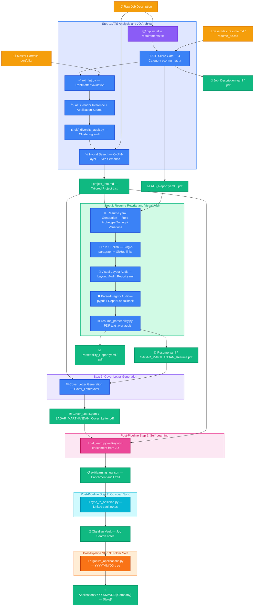

[//]: # (DEVELOPER DOCUMENTATION ONLY — not part of agent runtime context. Do not read this file during pipeline execution.)
# 📄 OKF-CV Resume & Cover Letter Tailoring Pipeline

An end-to-end, high-scannability, and ATS-optimized application materials generation pipeline. It uses structured YAML files for configuration, compiles them to PDF/LaTeX, and leverages Google OKF (Open Knowledge Format) matching to dynamically rank and inject relevant engineering projects from a master portfolio directory based on a target Job Description (JD).

The pipeline also counters **algorithmic monoculture** — the Stanford-studied phenomenon where repetitive ATS algorithmic filtration narrows opportunity. It tracks applicant-firm clustering by ATS vendor, prompts for application source diversification (referrals vs cold applies), highlights project verification links (clickable GitHub URLs on the resume), offers resume layout variations, lets the user choose between LaTeX and ReportLab (LM Roman 10) rendering modes, and runs an automated PDF parse-integrity audit (`resume_parseability.py`) that verifies the compiled PDF's text layer is ATS-parseable — checking unicode integrity, keyword recovery, section header detection, and contact info extraction.

---

## 🗺️ Architectural Workflow

The following diagram illustrates the data flow, offline semantic search, and the three-stage generation lifecycle:



---

## 💾 Hybrid Search Architecture (OKF + Zvec)

The portfolio search runs **100% locally and offline** using a hybrid approach that combines Google's **Open Knowledge Format (OKF)** phrase matching with **Zvec semantic embeddings** for score fusion:

- **Hybrid Search Engine:** [zvec_hybrid_search.py](zvec_hybrid_search.py) runs both OKF and Zvec search, then fuses scores: `final = (okf_score * 0.6) + (zvec_sim * 0.4)`. OKF provides precision for exact/synonym/stem/fuzzy matches. Zvec provides semantic recall for conceptual matches OKF can't see (e.g., "event streaming platform" → Kafka project).
- **OKF Bundle Structure:** The master portfolio is structured as a directory of modular Markdown files under `okf/portfolio/`, each carrying metadata in its YAML frontmatter block (e.g., `title`, `description`, `technologies`, `keywords`, `archetypes`, and `repo_url`).
- **OKF Matching Algorithm (4-layer):** The OKF component ([okf_portfolio_search.py](okf_portfolio_search.py)) uses a 4-layer matching strategy:
  1. **Exact phrase matching** — multi-word phrases as substrings, single words with word boundaries (no false positives from token splitting)
  2. **Synonym/alias expansion** — bidirectional map of 50+ domain terms (e.g., `kafka` ↔ `message queue`, `dbt` ↔ `transformation framework`, `terraform` ↔ `infrastructure as code`, `rag` ↔ `retrieval augmented generation`)
  3. **Light stemming** — strips common English suffixes (`-tion`, `-ing`, `-er`, `-ed`, `-es`, `-s`) for morphological variant matching (`orchestration` ↔ `orchestrator`, `pipeline` ↔ `pipelines`)
  4. **Fuzzy token matching** — `difflib.SequenceMatcher` with 0.85 ratio threshold for typo tolerance (`Databrick` → `Databricks`, `kuberntes` → `kubernetes`)
- **OKF Scoring:** Jaccard-style normalization prevents JD-length bias. Archetype boosts (+10 primary, +5 secondary) are applied when `ATS_Report.yaml` is provided. Tiebreaker: archetype match count, then tech match count, then alphabetical. Configurable `top_k` via CLI argument (default 4).
- **Zvec Semantic Layer:** All 14 portfolio files are embedded using `all-MiniLM-L6-v2` (384-dim vectors) and stored in a local Zvec database under `okf/zvec_db/`. Incremental re-embedding via content hash detection — only changed files are re-embedded. When `okf_learn.py` adds new keywords, modified files are automatically re-embedded into the Zvec database.
- **Score Fusion:** Zvec cosine similarity (0-1) is scaled to the OKF score range, then weighted: `final = (okf_score * 0.6) + (zvec_scaled * 0.4)`. Weights are configurable in `config.py` (`HYBRID_OKF_WEIGHT`, `HYBRID_ZVEC_WEIGHT`).
- **Cross-Process Safety:** All Zvec DB operations (ingestion, query, re-embed) are protected by a cross-process file lock (`zvec_db_lock()`). Uses OS-level locking (`msvcrt` on Windows, `fcntl` on Unix) with infinite wait (no timeout) and 0.5s retry interval. Agents wait indefinitely until the lock is released — no chance of concurrent access errors. CPU-bound work (embedding computation, hash detection) runs outside the lock to minimize hold time.
- **Frontmatter Linter:** [okf_lint.py](okf_lint.py) validates all portfolio files before scoring: checks for non-empty fields, canonical archetypes, denylisted tech tokens, description length, keyword count, title-token overlap, and `repo_url` URL format. Fails loud with the offending file + field.
- **Self-Learning Loop:** [okf_learn.py](okf_learn.py) runs post-application to enrich portfolio keywords from real JDs. Extracts domain-relevant terms, finds them in matched projects' bodies, and appends as new keywords. Max 3 per project per run, 15 per file cap, linter-validated with rollback, full audit trail in `okf/learning_log.json`.
- **Obsidian Vault Sync:** [sync_to_obsidian.py](sync_to_obsidian.py) syncs all applications to the Obsidian vault as linked notes (applications, companies, roles, skills, projects, ATS vendors, application sources) for graph-view navigation and knowledge management. Vendor and source backlink notes visualize clustering in Obsidian's Graph View.
- **Distilled Output:** The top matched projects are written to `project_info.md` as compact summaries (title + description + tech + archetypes + repo URL + body summary + match diagnostics comment) for use in Step 2.
- **Diversity Audit:** [okf_diversity_audit.py](okf_diversity_audit.py) scans the `Applications/` tree and reports ATS vendor clustering (warns at ≥3 applications to the same vendor in 14 days) and referral rate (warns at <20%). Advisory only — does not block the pipeline. Run in Step 1 to surface monoculture risk before submitting.

---

## 🛠️ Step-by-Step Execution Guide

The entire process is organized into 3 primary sequential steps, executed automatically by the agent when you supply a Job Description, followed by three post-pipeline steps (self-learning enrichment, Obsidian vault sync, and folder sorting):

### STEP 1: Setup, ATS Analysis & Job Description Archival
- **Name the Session (First Action):** Before any pipeline work, extract the Company Name and Job Role from the JD and rename the agent session/conversation to `[Company Name] — [Job Role]` in the UI sidebar. This makes it easy to identify which agent is handling which application when running multiple agents in parallel.
- **Dependency Ingest:** Automatically installs/updates pip dependencies (`pyyaml`, `reportlab`, `pypdf`) using Python 3.12.
- **Language Detection:** Identifies whether the JD is in English or German and loads corresponding base resume files.
- **ATS Pre-Scoring:** Grades the base resume against a calibrated 4-category German-market matrix (max 100 points).
  - **Score Gate:** If the ATS score is `< 85`, the pipeline triggers a `HOLD` verdict, presenting specific remedy suggestions (e.g., missing keywords, project mismatches). If `>= 85`, it sets `PROCEED`.
- **Frontmatter Lint:** Runs `okf_lint.py` to validate all portfolio files have clean YAML frontmatter (non-empty fields, canonical archetypes, no denylisted tech tokens, keyword quality checks, `repo_url` URL format). Fails before scoring if any violation is found.
- **ATS Vendor Inference & Application Source:** Scans the JD text and application URL for common ATS system footprints (Workday, Personio, SAP SuccessFactors, Greenhouse, Lever, Taleo). Prompts the user for the application source (Cold Apply, Referral, LinkedIn Connection, Direct). If Cold Apply + known vendor, warns the user to check their network for weak ties. Saves `ats_vendor`, `application_source`, and `weak_tie_contact` to `ATS_Report.yaml`.
- **Diversity Audit:** Runs `okf_diversity_audit.py` to check historical application distributions — vendor clustering (≥3 same vendor in 14 days triggers warning) and referral rate (<20% triggers warning). Advisory only.
- **Hybrid Project Selector:** Programmatically searches the local portfolio using a hybrid search engine ([zvec_hybrid_search.py](zvec_hybrid_search.py)) that combines OKF 4-layer phrase matching (exact, synonym, stemming, fuzzy) with Zvec semantic embeddings (all-MiniLM-L6-v2), archetype-boosted scoring (+10 primary, +5 secondary from `ATS_Report.yaml`), and Jaccard-style normalization. Score fusion: `final = (okf * 0.6) + (zvec * 0.4)`. Writes the top matching projects to a tailored `project_info.md` file with full hybrid diagnostics (OKF score, Zvec cosine, fused score).
- **Location Tailoring:** Extracts the job location from the job description and uses web search to determine the closest candidate location among Kiel (home), Frankfurt (friend), Berlin (friend), and Köln (friend).
- **Outputs:** `ATS_Report.yaml` & `Job_Description.yaml` (plus their compiled `.pdf` documents) and the tailored `project_info.md`.
- **Naming Convention (Critical):** The application folder and session name MUST be `[Company Name] — [Job Role]` extracted directly from the JD content. No arbitrary names, timestamps, or placeholders. This makes it easy to identify which session is running which application when multiple agents run in parallel.

### STEP 2: Resume Rewrite & Visual Layout Audit
- **Render Mode Selection:** Before compilation, the user chooses between `LaTeX` (pdflatex, `.tex` source preserved, agent-driven project polish) and `ReportFallback` (ReportLab with LM Roman 10 font, no `.tex` file, single-paragraph projects rendered automatically). The choice is stored as `render_mode` in `Resume.yaml` and `Cover_Letter.yaml`.
- **Tuned Resume Generation:** Writes `Resume.yaml` by tailoring descriptions, skills, and summary to align with the target role archetype and the retrieved local projects, and sets the contact location to the computed closest candidate city. Supports three `resume_variation` modes: `Balanced` (default — 3 projects, 4 experience bullets), `Project-Heavy` (4 verbose projects, simplified skills), and `Skills-Heavy` (3 projects, expanded skills block).
- **Project Verification Links:** Reads `Repo:` lines from `project_info.md` and copies them into each project block in `Resume.yaml` as `repo_url:`. These are compiled as clickable `[GitHub]` links next to project titles in the PDF — both in the LaTeX output (`\href{repo_url}{\color{darkblue}\small[GitHub]}`) and the ReportLab fallback (`<a href='...'>[GitHub]</a>`).
- **LaTeX Compilation & Project Format Polish:** Generates a professional LaTeX resume (`SAGAR_MARTHANDAN_Resume.tex` or `SAGAR_MARTHANDAN_Lebenslauf.tex` for German) and converts project listings from standard bullet points into a compact, single-paragraph prose block with tools woven in naturally. The LaTeX preamble includes `glyphtounicode` and `hyphenat` safeguards to prevent font ligature corruption and auto-hyphenation in ATS PDF-to-text parsers. (Skipped when `render_mode: reportfallback` — the ReportFallback renderer produces single-paragraph projects automatically.)
- **Uniform Spacing:** All project and experience entries are separated by a consistent `\vspace{6pt}` — no double-spacing, no variable gaps.
- **Constraints & Eye-Test Audit:** Runs character-length audits:
  - Experience bullets: Must be strictly single-line and `<= 105` characters.
  - Project paragraphs: Must be `<= 300` characters total (`<= 250` characters for German projects) and fit within `<= 3` lines.
  - Summary: Exactly 4 lines of text, maximum 420 characters (maximum 380 characters for German Zusammenfassung).
  - Stop-Slop writing rules: Strict active voice, no `-ly` adverbs, zero em-dashes, no filler text.
- **Self-Correction:** Resolves any line-wraps or overflows dynamically.
- **Parse-Integrity Audit (LaTeX mode):** After LaTeX compilation, the PDF is automatically audited using `pypdf` — extracts the text layer, checks for Unicode replacement glyphs (U+FFFD), and cross-references critical keywords/tools from `Resume.yaml` against the extracted text. If the audit fails (recovery < 100% or corruptions found), the ReportLab compiler is triggered as a fallback to overwrite the PDF with a highly parsable version. The fallback PDF is re-audited; if it also fails, the pipeline halts. Results written to `Layout_Audit_Report.yaml` under `parse_integrity_verification`.
- **Resume Parseability Audit (both modes):** After the final resume PDF is compiled (either via LaTeX or ReportFallback), [resume_parseability.py](resume_parseability.py) runs a standalone parse-integrity audit on the PDF — the actual document submitted to companies. It extracts the PDF text layer via `pypdf` and checks: (1) Unicode integrity (no replacement glyphs), (2) keyword recovery (every tool, skill, and significant summary word from `Resume.yaml` is recoverable from the PDF text, with line-break splitting handled via whitespace normalization), (3) section header detection (all 6 standard sections present), (4) contact info extraction (name, phone, email, GitHub, LinkedIn), and (5) text structure stats. Outputs `Parseability_Report.yaml` (structured) and `Parseability_Report.pdf` (human-readable, LM Roman 10). Pass criteria: 100% keyword recovery, 6/6 sections, 5/5 contact fields, zero unicode corruptions.
- **Post-Rewrite ATS Rescoring:** Updates `post_rewrite_ats_score` in `ATS_Report.yaml` and recompiles `ATS_Report.pdf`.
- **Outputs:** `Resume.yaml`, `SAGAR_MARTHANDAN_Resume.pdf` / `SAGAR_MARTHANDAN_Lebenslauf.pdf` (along with preserved LaTeX `.tex` sources when applicable), `Layout_Audit_Report.yaml` (including `parse_integrity_verification`), `Parseability_Report.yaml` & `Parseability_Report.pdf`, and the post-rewrite ATS rescoring results updated inside `ATS_Report.yaml`.

### STEP 3: Cover Letter Generation
- **Geschäftsbrief Layout:** Generates a metric-grounded cover letter adapted to formal German business formatting, set to the computed closest candidate location (both in the sender address and date/city header).
- **Application Source Integration:** If `application_source` in `ATS_Report.yaml` is `Referral` or `LinkedIn Connection`, mentions the `weak_tie_contact` name/role in paragraph 1. Project `repo_url` links are woven into paragraph deep dives where relevant.
- **Strict Limits:** Restricts cover letter content to exactly one page, 4 paragraphs, and **250–320 words** total (restricted to **180–240 words** for German cover letters to prevent A4 overflow).
- **Outputs:** `Cover_Letter.yaml` and compiled `SAGAR_MARTHANDAN_Cover_Letter.pdf` / `SAGAR_MARTHANDAN_Anschreiben.pdf` (along with preserved LaTeX `.tex` sources).

### Post-Pipeline Step 1: Self-Learning Keyword Enrichment
- **Keyword Learning:** After the cover letter compiles, [okf_learn.py](okf_learn.py) extracts domain-relevant terms from the processed Job Description, finds terms that appear in matched projects' bodies but are missing from their keyword lists, and appends them.
- **Safeguards:** Max 3 new keywords per project per run, 15 keywords per file max (linter enforced with rollback), every change logged to `okf/learning_log.json` with timestamp and JD source.
- **Idempotent:** Re-running on the same application folder is a no-op (no duplicate keywords added).

### Post-Pipeline Step 2: Obsidian Vault Sync
- **Graph-View Navigation:** After the learning loop, [sync_to_obsidian.py](sync_to_obsidian.py) walks the entire `Applications/` tree and generates linked Obsidian notes under `<vault>/Job Search/`.
- **Note Types:** One note per application, company, role archetype, skill, project, ATS vendor, and application source. Wikilinks connect applications to companies, roles, skills, projects, vendors, and sources for graph-view navigation. Vendor and source backlink notes visualize clustering immediately in Obsidian's Graph View.
- **Format Support:** Handles both YAML and MD application formats automatically. Parses `ats_vendor`, `application_source`, and `weak_tie_contact` from both formats.
- **Standalone Use:** Run `python sync_to_obsidian.py` to sync all applications, or use `--dry-run` to preview without writing.

### Post-Pipeline Step 3: Application Folder Sorting
- **Prerequisite:** Obsidian sync (Step 2) MUST complete successfully before this step. Do NOT run `organize_applications.py` until `sync_to_obsidian.py` has finished — the folder must remain at `Applications/[Company Name] — [Job Role]/` during sync so the sync script can find it.
- **Date-Organized Tree:** After Obsidian sync succeeds, [organize_applications.py](organize_applications.py) moves the just-created application folder into `Applications/YYYY/MM/DD/[Company Name] — [Job Role]/`, bucketed by the folder's creation time.
- **Idempotent:** Re-running the script is a no-op on already-sorted folders.
- **Standalone Use:** Run `python organize_applications.py` to sort all existing unsorted folders in `Applications/`, or `python organize_applications.py "Applications/[Company] — [Role]"` to sort a single folder. Use `--dry-run` to preview moves without applying them.

---

## 📂 Project Directory Structure

```
YAML-CV/
├── skills\
│   └── okf-cv\
│       ├── SKILL.md                      # Agent-facing skill metadata
│       ├── README.md                     # This file (developer documentation)
│       ├── OKF_IMPROVEMENT_PLAN.md       # OKF improvement plan & Phase 6 design
│       ├── IMPLEMENTATION_PLAN.md        # Monoculture countermeasures implementation plan
│       ├── 01_ats_and_jd_archival.md     # Step 1 detailed agent rules
│       ├── 02_resume_and_visual_audit.md # Step 2 detailed agent rules
│       ├── 03_cover_letter.md            # Step 3 detailed agent rules
│       ├── requirements.txt              # Pipeline dependencies (pyyaml, reportlab, pypdf, zvec, sentence-transformers)
│       ├── config.py                     # Centralized paths and constants
│       ├── yaml_to_pdf.py                # Main YAML compilation router (supports resume, cover_letter, job_description, ats_report, parseability_report)
│       ├── resume_parseability.py        # ATS parse-integrity audit script (checks PDF text layer: unicode, keywords, sections, contact info)
│       ├── zvec_hybrid_search.py       # Hybrid search (OKF phrase matching + Zvec semantic embeddings, score fusion)
│       ├── okf_portfolio_search.py       # OKF search engine (4-layer matching, archetype boost, Jaccard normalization) — fallback if Zvec unavailable
│       ├── okf_lint.py                   # Frontmatter linter for portfolio files
│       ├── okf_learn.py                  # Self-learning keyword enrichment (post-application)
│       ├── okf_diversity_audit.py        # Clustering audit utility (vendor clustering + referral rate warnings)
│       ├── sync_to_obsidian.py           # Syncs applications to Obsidian vault as linked notes
│       ├── organize_applications.py      # Sorts application folders into YYYY/MM/DD tree (post-pipeline)
│       ├── okf/                          # Self-contained OKF Knowledge Base
│       │   ├── portfolio/                # 15 individual OKF project markdown files
│       │   ├── zvec_db/                  # Zvec vector database (auto-generated, hash-indexed for incremental re-embedding)
│       │   ├── base_files/
│       │   │   ├── english/              # English base resume.md
│       │   │   └── german/               # German base resume_de.md
│       │   ├── photo/                    # Sagar.jpg for LaTeX templates
│       │   └── learning_log.json         # Self-learning enrichment audit trail
│       ├── renderers\                    # LaTeX/ReportLab rendering handlers
│       │   ├── utils.py                  # Shared utilities (escape_latex, fonts, run_pdflatex, register_lm_roman_10)
│       │   ├── resume_common.py          # Shared resume helpers (HEADERS, get_resume_language)
│       │   ├── resume.py                 # Resume renderer dispatcher (reads render_mode, routes to latex or reportfallback)
│       │   ├── resume_latex.py           # Resume LaTeX renderer + parse-integrity audit
│       │   ├── resume_reportfallback.py  # Resume ReportLab renderer (LM Roman 10, single-paragraph projects)
│       │   ├── cover_letter.py           # Cover Letter renderer dispatcher (reads render_mode)
│       │   ├── cover_letter_latex.py     # Cover Letter LaTeX renderer
│       │   ├── cover_letter_reportfallback.py  # Cover Letter ReportLab renderer (LM Roman 10)
│       │   ├── job_description.py        # Job Description renderer (ReportLab only)
│       │   ├── ats_report.py             # ATS Report renderer (ReportLab only)
│       │   └── parseability_report.py    # Parseability Report renderer (ReportLab only, LM Roman 10)
│       └── tests/
│           ├── test_utils.py             # Unit tests for LaTeX escaping and formatting
│           └── test_okf_search.py        # Automated test suite for OKF search
└── Applications\
    └── YYYY\
        └── MM\
            └── DD\
                └── [Company Name] — [Job Role]\      # Application folder (sorted by creation date)
                    ├── Job_Description.yaml / .pdf
                    ├── ATS_Report.yaml / .pdf
                    ├── project_info.md               # Tailored & distilled project list
                    ├── Resume.yaml / Layout_Audit_Report.yaml / Cover_Letter.yaml
                    ├── Parseability_Report.yaml / .pdf  # ATS parse-integrity audit results
                    ├── SAGAR_MARTHANDAN_Resume.pdf / .tex  (or Lebenslauf.pdf / .tex for German)
                    └── SAGAR_MARTHANDAN_Cover_Letter.pdf / .tex  (or Anschreiben.pdf / .tex for German)
```

---

## 🚀 How to Run the Pipeline

Since all the pipeline steps are natively codified into the agent's custom skills directory, you do not need to copy-paste any external prompts.

To execute the pipeline:
1. Paste the target **Job Description** (JD) into the chat.
2. Type: **`execute okf-cv`** (or keywords like *"tailor resume"* / *"optimize resume"*).
3. The agent will automatically run the end-to-end flow: installing dependencies, linting portfolio frontmatter, searching matching projects using hybrid search (OKF phrase matching + Zvec semantic embeddings with score fusion), compiling the ATS reports, writing the final tailored files to the `Applications/` directory, enriching portfolio keywords via the self-learning loop (with automatic Zvec re-embedding), syncing to the Obsidian vault, and sorting the application folder into the `Applications/YYYY/MM/DD/` date tree.

---

## 🧪 Testing

Run the automated test suite to verify search relevance:
```powershell
cd "[skill directory]"
C:\Users\sagar\AppData\Local\Programs\Python\Python312\python.exe "C:\Users\sagar\Documents\YAML-CV\skills\okf-cv\tests\test_okf_search.py"
```

The suite includes 3 test cases:
1. **Data Engineering search** with archetype boost — verifies DE projects rank in top-3
2. **AI/RAG Developer search** with dual archetype — verifies RAG project ranks #1
3. **Smoke test** with generic DE JD — verifies at least 2 expected DE projects appear in top-3

Run the hybrid search standalone (OKF + Zvec score fusion):
```powershell
C:\Users\sagar\AppData\Local\Programs\Python\Python312\python.exe "C:\Users\sagar\Documents\YAML-CV\skills\okf-cv\zvec_hybrid_search.py" "Job_Description.yaml" "project_info.md" "ATS_Report.yaml"
```

Run the frontmatter linter standalone:
```powershell
C:\Users\sagar\AppData\Local\Programs\Python\Python312\python.exe "C:\Users\sagar\Documents\YAML-CV\skills\okf-cv\okf_lint.py"
```

Run the diversity audit standalone (checks vendor clustering and referral rate):
```powershell
C:\Users\sagar\AppData\Local\Programs\Python\Python312\python.exe "C:\Users\sagar\Documents\YAML-CV\skills\okf-cv\okf_diversity_audit.py"
```

Run the resume parseability audit standalone (checks PDF text layer for ATS parseability):
```powershell
cd "Applications/[Company Name] — [Job Role]/"
C:\Users\sagar\AppData\Local\Programs\Python\Python312\python.exe "C:\Users\sagar\Documents\YAML-CV\skills\okf-cv\resume_parseability.py" "SAGAR_MARTHANDAN_Resume.pdf" "Resume.yaml"
```
The script reads the compiled PDF (the document submitted to companies) and uses the YAML as the expected-values reference. It checks: unicode integrity (no replacement glyphs), keyword recovery (all tools/skills/summary words recoverable from the PDF text), section header detection (6/6), contact info extraction (5/5), and text structure stats. Outputs `Parseability_Report.yaml` + `Parseability_Report.pdf`. Exit code 0 = pass, 1 = fail, 2 = error.

Run the self-learning loop standalone:
```powershell
C:\Users\sagar\AppData\Local\Programs\Python\Python312\python.exe "C:\Users\sagar\Documents\YAML-CV\skills\okf-cv\okf_learn.py" "Applications/[Company Name] — [Job Role]"
```

Sync applications to Obsidian vault:
```powershell
C:\Users\sagar\AppData\Local\Programs\Python\Python312\python.exe "C:\Users\sagar\Documents\YAML-CV\skills\okf-cv\sync_to_obsidian.py"
```

---

## 📋 Changelog

See [CHANGELOG.md](CHANGELOG.md) for the full version history (v1–v27).
