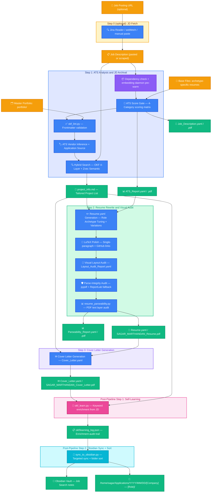

[//]: # (DEVELOPER DOCUMENTATION ONLY — not part of agent runtime context. Do not read this file during pipeline execution.)
# OKF-CV Resume & Cover Letter Tailoring Pipeline

An end-to-end, ATS-optimized application materials generation pipeline. Paste a job description — or just paste a job posting URL and let the pipeline scrape it for you — and get a tailored resume + cover letter as compiled PDFs, plus an archived JD reference and an ATS score report.

The pipeline also counters **algorithmic monoculture** — the Stanford-studied phenomenon where repetitive ATS algorithmic filtration narrows opportunity. It tracks applicant-firm clustering by ATS vendor, prompts for application source diversification (referrals vs cold applies), highlights project verification links (clickable GitHub URLs on the resume), offers resume layout variations, and runs an automated PDF parse-integrity audit that verifies the compiled PDF's text layer is ATS-parseable.

---

## Tech Stack

<div align="center">


</div>

| Component | Role |
|---|---|
| **Python 3.10+** | Pipeline runtime |
| **PyYAML** | Structured config + application output format |
| **ReportLab** (LM Roman 10) | ReportFallback PDF renderer (no LaTeX install needed) |
| **LaTeX** (pdflatex) | High-fidelity PDF renderer (`.tex` source preserved) |
| **pypdf** | PDF text-layer extraction for parse-integrity audit |
| **Sentence Transformers** (`all-MiniLM-L6-v2`) | 384-dim semantic embeddings for Zvec search |
| **Zvec** | Local vector DB for semantic portfolio search |
| **Obsidian** | Vault sync for graph-view application tracking |
| **Jina Reader** | URL → clean markdown scraping (Step 0, JS-SPA sites) |

---

## Architectural Workflow


```mermaid
graph TD
    classDef input fill:#f59e0b,stroke:#d97706,stroke-width:2px,color:#fffbeb;
    classDef processing fill:#3b82f6,stroke:#1d4ed8,stroke-width:2px,color:#eff6ff;
    classDef output fill:#10b981,stroke:#059669,stroke-width:2px,color:#ecfdf5;
    classDef system fill:#8b5cf6,stroke:#6d28d9,stroke-width:2px,color:#f5f3ff;
    classDef learn fill:#ec4899,stroke:#be185d,stroke-width:2px,color:#fdf2f8;
    classDef sync fill:#06b6d4,stroke:#0891b2,stroke-width:2px,color:#ecfeff;

    style Step0 fill:#fef3c7,stroke:#f59e0b,stroke-width:2px,color:#78350f
    style Step1 fill:#e0e7ff,stroke:#3b82f6,stroke-width:2px,color:#1e3a8a
    style Step2 fill:#d1fae5,stroke:#10b981,stroke-width:2px,color:#059669
    style Step3 fill:#ede9fe,stroke:#8b5cf6,stroke-width:2px,color:#7c3aed
    style Post1 fill:#fce7f3,stroke:#ec4899,stroke-width:2px,color:#be185d
    style Post2 fill:#cffafe,stroke:#06b6d4,stroke-width:2px,color:#0891b2

    URL["🔗 Job Posting URL (optional)"]:::input
    JD["📋 Job Description (pasted or scraped)"]:::input
    BaseFiles["📄 Base Files: archetype-specific resumes"]:::input
    RepoInfo["🗂 Master Portfolio: portfolio/"]:::input

    subgraph Step0 ["Step 0 (optional): JD Fetch"]
        Scrape["🔍 Jina Reader / webfetch / manual paste"]:::processing
    end

    subgraph Step1 ["Step 1: ATS Analysis and JD Archival"]
        Deps["📦 Dependency check + embedding daemon pre-warm"]:::system
        ATS["🎯 ATS Score Gate — 4-Category scoring matrix"]:::processing
        Lint["✅ okf_lint.py — Frontmatter validation"]:::processing
        Vendor["🏷️ ATS Vendor Inference + Application Source"]:::processing
        OKF["🔍 Hybrid Search — OKF 4-Layer + Zvec Semantic"]:::processing
    end

    subgraph Step2 ["Step 2: Resume Rewrite and Visual Audit"]
        Rewrite["✏️ Resume.yaml Generation — Role Archetype Tuning + Variations"]:::processing
        LaTeX["📐 LaTeX Polish — Single-paragraph + GitHub links"]:::processing
        Audit["🔬 Visual Layout Audit — Layout_Audit_Report.yaml"]:::processing
        ParseIntegrity["🛡️ Parse-Integrity Audit — pypdf + ReportLab fallback"]:::processing
        Parseability["📊 resume_parseability.py — PDF text layer audit"]:::processing
    end

    subgraph Step3 ["Step 3: Cover Letter Generation"]
        CL["✉ Cover Letter Generation — Cover_Letter.yaml"]:::processing
    end

    subgraph Post1 ["Post-Pipeline Step 1: Self-Learning"]
        Learn["🧠 okf_learn.py — Keyword enrichment from JD"]:::learn
    end

    subgraph Post2 ["Post-Pipeline Step 2: Obsidian Sync + Sort"]
        Sync["🔗 sync_to_obsidian.py — Targeted sync + folder sort"]:::sync
    end

    OutJD["📄 Job_Description.yaml / .pdf"]:::output
    OutATS["📊 ATS_Report.yaml / .pdf"]:::output
    OutProj["📝 project_info.md — Tailored Project List"]:::output
    OutRes["📄 Resume.yaml / SAGAR_MARTHANDAN_Resume.pdf"]:::output
    OutParse["📊 Parseability_Report.yaml / .pdf"]:::output
    OutCL["✉ Cover_Letter.yaml / SAGAR_MARTHANDAN_Cover_Letter.pdf"]:::output
    OutLog["📋 okf/learning_log.json — Enrichment audit trail"]:::output
    OutVault["🔮 Obsidian Vault — Job Search notes"]:::output
    OutTree["📁 /home/sagar/Applications/YYYY/MM/DD/[Company] — [Role]/"]:::output

    URL --> Scrape
    Scrape --> JD
    JD --> Deps
    Deps --> ATS
    BaseFiles --> ATS

    ATS --> Lint
    RepoInfo --> Lint
    Lint --> Vendor
    Vendor --> OKF
    JD --> OKF

    ATS --> OutATS
    ATS --> OutJD
    OKF --> OutProj

    OutProj --> Rewrite
    OutATS --> Rewrite
    Rewrite --> LaTeX
    LaTeX --> Audit
    Audit --> ParseIntegrity
    ParseIntegrity --> Parseability
    Parseability --> OutRes
    Parseability --> OutParse

    OutProj --> CL
    OutRes --> CL
    CL --> OutCL

    OutCL --> Learn
    OutProj --> Learn
    Learn --> OutLog

    OutLog --> Sync
    Sync --> OutVault
    Sync --> OutTree
```

---

## Pipeline at a Glance

| Step | What it does | Key outputs |
|---|---|---|
| **Step 0** (optional) | Scrape a job posting URL into clean JD text. Jina Reader for JS-SPA sites (LinkedIn, Workday, Greenhouse), local webfetch for static sites, manual paste as final fallback. | Clean JD text + `source_url` |
| **Step 1** | ATS analysis, archetype detection, hybrid portfolio search (OKF + Zvec), JD archival. Embedding daemon pre-warmed to eliminate ~70s cold start. | `ATS_Report.yaml/.pdf`, `Job_Description.yaml/.pdf`, `project_info.md` |
| **Step 2** | Resume rewrite, LaTeX/ReportLab compilation, visual layout audit, parse-integrity audit, post-rewrite ATS rescoring. | `Resume.yaml`, `SAGAR_MARTHANDAN_Resume.pdf`, `Layout_Audit_Report.yaml`, `Parseability_Report.yaml/.pdf` |
| **Step 3** | Cover letter generation (DIN 5008 Form B layout for German, business letter for English), gender-tag stripping, application source integration. | `Cover_Letter.yaml`, `SAGAR_MARTHANDAN_Cover_Letter.pdf` |
| **Post 1** | Self-learning keyword enrichment from JD terms found in matched projects. | `okf/learning_log.json` |
| **Post 2** | Obsidian vault sync (graph-view navigation) + folder sort into `/home/sagar/Applications/YYYY/MM/DD/` tree with resilient move (retry + copy+delete fallback). | Obsidian notes + sorted application folder |
| **Weekly review** (manual) | Record interview/rejection/ghosted outcomes and application source per application via `track_outcomes.py`; review response rate by archetype and channel; check ATS-vendor clustering and referral rate via `okf_diversity_audit.py`. | `Application_Status.yaml`, response-rate digest |

For the full step-by-step execution guide with deep technical details (hybrid search architecture, OKF 4-layer matching algorithm, Zvec score fusion, cross-process file locking, embedding daemon, parse-integrity audit, DIN 5008 layout, gender-tag stripping, etc.), see **[docs/ARCHITECTURE.md](docs/ARCHITECTURE.md)**.

---

## How to Run the Pipeline

Since all the pipeline steps are natively codified into the agent's custom skills directory, you do not need to copy-paste any external prompts.

### Prerequisites

The pipeline uses a **project-local Python virtual environment** at `/home/sagar/Skills/okf-cv/.venv/`. All dependencies are pre-installed there:

- **Python 3.10+** (system)
- **`.venv/`** — virtual environment with `pyyaml`, `reportlab`, `pypdf`, `zvec`, `sentence-transformers` (see `requirements.txt`)
- **TeX Live** — for LaTeX-mode PDF compilation (`pdflatex`). Install on Debian/Ubuntu with:
  ```bash
  sudo apt-get install -y texlive-latex-base texlive-latex-recommended texlive-latex-extra texlive-fonts-recommended texlive-lang-german
  ```
- **Fonts** — Latin Modern Roman 10, CMU Concrete, Google Sans Code, Calibri/Carlito, Segoe UI, Cambria (installed in `~/.local/share/fonts/`)

All pipeline scripts are invoked with `/home/sagar/Skills/okf-cv/.venv/bin/python` (not the system `python3`). The venv is gitignored — do NOT run `pip install` during a pipeline run.

To execute the pipeline:
1. Paste the target **Job Description** (JD) into the chat — **or** paste a job posting URL and the pipeline will scrape it for you (see Step 0 above).
2. Type: **`execute okf-cv`** (or keywords like *"tailor resume"* / *"optimize resume"* / *"job link"* / *"scrape this posting"*).
3. The agent will automatically run the end-to-end flow: (optionally scraping the JD from a URL), pre-warming the embedding daemon, linting portfolio frontmatter, searching matching projects using hybrid search (OKF phrase matching + Zvec semantic embeddings with score fusion), compiling the ATS reports, writing the final tailored files to the `/home/sagar/Applications/` directory, enriching portfolio keywords via the self-learning loop (with automatic Zvec re-embedding), syncing to the Obsidian vault, and sorting the application folder into the `/home/sagar/Applications/YYYY/MM/DD/` date tree.

### Self-Refresh

To reload the skill into the current CLI/harness skill store (e.g. after pulling updates or switching branches), type: **`refresh okf-cv`**. The agent will:
1. Identify the CLI environment (Devin, Claude Code, agy, opencode, etc.) and its skill/workflows directory.
2. Locate the ground truth `SKILL.md` — first check `skills/okf-cv/SKILL.md` on the local filesystem. If that file is missing, unreadable, or stale, pull the latest version directly from the canonical GitHub repo at **https://github.com/SagarMarthandan/okf-cv** (path: `skills/okf-cv/SKILL.md`) via `webfetch` or `git pull`.
3. Copy the located `SKILL.md` to the CLI's active skill store path.
4. Confirm the load via the CLI's skill resolution mechanism.
5. Ingest all supporting `.md` files in `skills/okf-cv/` (the step files `00_*.md`, `01_*.md`, `02_*.md`, `03_*.md`, and any others) to load the full pipeline into context. If any supporting doc is missing locally, fetch it from **https://github.com/SagarMarthandan/okf-cv** using the same fallback as step 2.

No other actions are performed. This is a metadata/context reload only — it does not run the pipeline or modify any application files.

---

## Documentation

| Document | Description |
|---|---|
| [docs/ARCHITECTURE.md](docs/ARCHITECTURE.md) | Deep technical reference: hybrid search architecture, OKF 4-layer matching, Zvec score fusion, step-by-step execution guide, project directory structure, testing commands |
| [docs/CHANGELOG.md](docs/CHANGELOG.md) | Full version history (v1–v28.22) |
| [SKILL.md](SKILL.md) | Agent-facing skill metadata and pipeline execution rules |
| [00_jd_fetch.md](00_jd_fetch.md) | Step 0 detailed agent rules (URL → JD text) |
| [01_ats_and_jd_archival.md](01_ats_and_jd_archival.md) | Step 1 detailed agent rules |
| [02_resume_and_visual_audit.md](02_resume_and_visual_audit.md) | Step 2 detailed agent rules |
| [03_cover_letter.md](03_cover_letter.md) | Step 3 detailed agent rules |

---

## Changelog

See [docs/CHANGELOG.md](docs/CHANGELOG.md) for the full version history (v1–v28.25).
