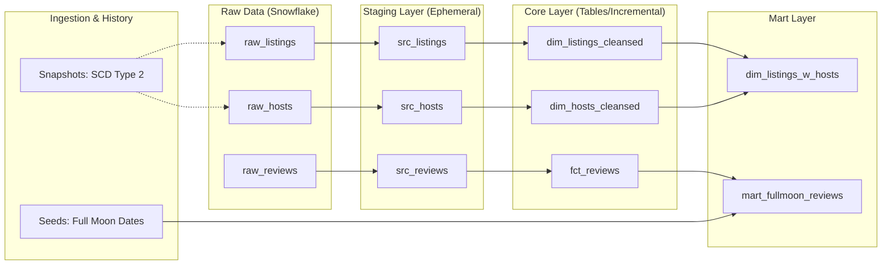

# Airbnb Data Engineering Project (dbt + Snowflake + Dagster)

[](https://www.getdbt.com/)
[](https://www.snowflake.com/)
[](https://dagster.io/)
[](https://www.python.org/)
[](https://en.wikipedia.org/wiki/SQL)

---

## 📖 Overview

Welcome to the **Airbnb Data Transformation Engine**! This project is a comprehensive end-to-end data engineering pipeline built as part of the **Udemy "Complete dbt Bootcamp"**.

It demonstrates modern data stack (MDS) principles by transforming raw Airbnb data into a clean, well-documented, and highly tested analytics-ready layer using **dbt (data build tool)**, orchestrated by **Dagster**, and hosted on **Snowflake**.

### 🌟 Key Features

- ⚡ **Incremental Loading**: Optimized fact tables for performance.
- 🕰️ **SCD Type 2 Snapshots**: Tracking history of hosts and listings.
- 🛡️ **Data Quality**: Extensive testing using `dbt_expectations`.
- 🏗️ **Modular Design**: Clear separation of Staging, Core, and Mart layers.
- ⚙️ **Custom Macros**: Automated repetitive logic like cleansing and validation.
- 📅 **Orchestration**: Seamless integration with Dagster for asset-based scheduling.

---

## 🏗️ Project Architecture

The following diagram illustrates the journey of data from raw CSV files to the final business-ready marts.



---

## 🔍 Stage-by-Stage Breakdown

### 1️⃣ Data Ingestion & Seeds 🌰

We start by loading static or reference data into Snowflake.

- **`seed_full_moon_dates`**: A lookup table containing dates of full moons. This is used in our final mart to analyze if full moons correlate with listing review sentiments (a playful but technically rigorous exercise in joining disparate datasets).

### 2️⃣ Snapshots (SCD Type 2) 📸

Tracking history is crucial for auditing and longitudinal analysis. We use the **Timestamp Strategy** for change detection.

- **`scd_raw_hosts`**: Tracks changes in the `raw_hosts` source. If a host's name or superhost status changes, dbt automatically invalidates the old record and creates a new one with updated `dbt_valid_from` and `dbt_valid_to` timestamps.
- **`scd_raw_listings`**: Monitors the `raw_listings` source for updates to prices, room types, or minimum stay requirements.

### 3️⃣ Staging Layer (The "Refinement" Phase) 💎

Located in `models/src/`, these models are the first line of transformation. They are configured as **ephemeral** to avoid creating unnecessary database objects while maintaining a clean abstraction.

- **`src_listings`**: Renames raw columns (e.g., `id` to `listing_id`) and selects only the necessary fields for downstream processing.
- **`src_hosts`**: Standardizes host information and prepares it for the cleansing layer.
- **`src_reviews`**: Casts raw timestamps and prepares review text for fact-table indexing.

### 4️⃣ Core Layer (Dimensions & Facts) 🏗️

This is the "Source of Truth" layer where business logic is applied and data is persisted as tables or views.

#### Dimensions (`dim/`)

- **`dim_listings_cleansed`**:
  - **Logic**: Handles edge cases where `minimum_nights` is reported as 0 by defaulting it to 1.
  - **Cleaning**: Strips currency symbols (`$`) and commas from price strings, casting them to `NUMBER(10,2)` for mathematical operations.
- **`dim_hosts_cleansed`**:
  - **Logic**: Implements `NVL` logic to replace missing host names with "Anonymous".
  - **Enforcement**: Uses **Model Contracts** to ensure that `host_id` is always an integer and names are strings, preventing schema drift.
- **`dim_listings_w_hosts`**:
  - **Logic**: A "Wide Dimension" that performs a `LEFT JOIN` between listings and hosts.
  - **Auditability**: Calculates a global `updated_at` using the `GREATEST()` function, ensuring we know the last time _any_ part of the listing/host relationship changed.

#### Facts (`fct/`)

- **`fct_reviews`**:
  - **Materialization**: **Incremental**. This model only processes new reviews since the last run, significantly reducing Snowflake compute costs.
  - **Surrogate Keys**: Uses `dbt_utils.generate_surrogate_key` to create a unique hash for each review based on listing ID, date, and text.
  - **Idempotency**: Includes logic to handle specific date range reloads via dbt variables (`start_date`, `end_date`).

### 5️⃣ Business Marts 📊

The final presentation layer, optimized for BI tools and stakeholders.

- **`mart_fullmoon_reviews`**:
  - **Business Logic**: Joins `fct_reviews` with the `seed_full_moon_dates`.
  - **Derived Field**: Adds an `is_full_moon` boolean flag. This allows analysts to test the "Transylvania Effect" (whether people write more/wilder reviews during full moons).

---

## 📋 Model Dictionary

| Layer           | Model                   | Materialization | Description                                   |
| :-------------- | :---------------------- | :-------------- | :-------------------------------------------- |
| **Seeds**       | `seed_full_moon_dates`  | `seed`          | Calendar of full moon dates.                  |
| **Snapshots**   | `scd_raw_hosts`         | `snapshot`      | SCD Type 2 history for hosts.                 |
| **Snapshots**   | `scd_raw_listings`      | `snapshot`      | SCD Type 2 history for listings.              |
| **Staging**     | `src_listings`          | `ephemeral`     | Rename & select for listings.                 |
| **Staging**     | `src_hosts`             | `ephemeral`     | Rename & select for hosts.                    |
| **Staging**     | `src_reviews`           | `ephemeral`     | Rename & select for reviews.                  |
| **Core (Dim)**  | `dim_listings_cleansed` | `view`          | Cleansed listing details.                     |
| **Core (Dim)**  | `dim_hosts_cleansed`    | `view`          | Cleansed host details (with contract).        |
| **Core (Dim)**  | `dim_listings_w_hosts`  | `table`         | Joined listing + host dimension.              |
| **Core (Fact)** | `fct_reviews`           | `incremental`   | Incremental review facts with surrogate keys. |
| **Mart**        | `mart_fullmoon_reviews` | `table`         | Review facts joined with full moon seeds.     |

---

## 🛡️ Data Quality & Governance

We treat data quality as a first-class citizen. The pipeline includes multiple layers of defense:

### 1. Automated Testing 🧪

- **Generic Tests**: We use `unique`, `not_null`, and `relationships` tests to ensure referential integrity.
- **dbt Expectations**: We leverage the `dbt_expectations` package for advanced validation:
  - **Row Count Matching**: Ensuring our final marts match source row counts.
  - **Regex Validation**: Verifying that price strings match expected currency patterns before cleansing.
  - **Quantile Checks**: Monitoring for outliers in price data.
- **Custom Tests**: Implemented `positive_values` to ensure data sanity in fields like `minimum_nights`.

### 2. Model Contracts & Constraints 📜

In `dim_hosts_cleansed`, we implemented **Model Contracts**. This enforces:

- **Schema Integrity**: The model will fail to build if the Snowflake data types don't match the YAML definition.
- **Nullability**: Critical columns are strictly enforced at the database level.

### 3. Audit Logging 📑

To monitor pipeline health, we use dbt hooks:

- **`on-run-start`**: Automatically creates an `audit_log` table if it doesn't exist.
- **`post-hook`**: Every time a model runs, a record is inserted into `audit_log` with the model name and completion timestamp, allowing for detailed performance and lineage tracking.

---

## 🛠️ Custom Macros & Logic

To keep our code **DRY (Don't Repeat Yourself)**, we implemented several custom macros:

- **`no_empty_strings`**: Dynamically generates `IS NOT NULL` checks for every string column in a model.
- **`select_positive_values`**: A reusable filter to ensure numeric columns (like price or nights) contain valid, positive data.
- **`logging`**: Custom Jinja logic to provide real-time feedback in the console during incremental loads.

---

## 🛠️ Tech Stack & Tooling

| Tool                 | Purpose                                            |
| :------------------- | :------------------------------------------------- |
| **dbt**              | Transformation logic, documentation, and testing.  |
| **Snowflake**        | Cloud Data Warehouse for storage and compute.      |
| **Dagster**          | Orchestrating dbt runs and managing dependencies.  |
| **dbt_expectations** | Advanced data quality tests (unit tests for data). |
| **Python / uv**      | Dependency and environment management.             |

---

## 🔐 Missing / Hidden Variables & Secrets

To run this project, you need several "hidden" configurations that are not stored in the repository for security reasons.

### 1. `profiles.yml` Setup

Create or update your `~/.dbt/profiles.yml`:

```yaml
airbnb:
  target: dev
  outputs:
    dev:
      type: snowflake
      account: <your_snowflake_account_id>
      user: dbt
      role: TRANSFORM
      database: AIRBNB
      schema: DEV
      warehouse: COMPUTE_WH
      threads: 1
      # Authentication options:
      authenticator: externalbrowser # Or use private key below
      # private_key: "/path/to/your/rsa_key.p8"
      # private_key_passphrase: <your_passphrase>
```

### 2. Snowflake Private Key

If using Key-Pair authentication, you must generate an RSA key and add the public key to your Snowflake user:

```sql
ALTER USER dbt SET RSA_PUBLIC_KEY='<your_public_key>';
```

---

## 🚀 How to Install & Run

Follow these steps to get your local environment up and running.

### 1. Clone the Repository

```bash
git clone https://github.com/SagarMarthandan/DBT-Airbnb-Practice-Project.git
cd dbt-course
```

### 2. Set up Python Environment

We recommend using `uv` for speed, but `pip` works too.

```bash
# Using uv
uv venv
source .venv/bin/activate # or .venv\Scripts\activate on Windows
uv pip install -r pyproject.toml
```

### 3. Install dbt Dependencies

```bash
cd airbnb
dbt deps
```

### 4. Initialize Data

```bash
dbt seed
dbt snapshot
```

### 5. Run the Pipeline

```bash
dbt run
dbt test
```

### 6. Start Orchestration (Dagster)

```bash
cd ../my_dbt_dagster_project
dagster dev
```

---

## 🤝 Contributors & Credits

This project was built following the **Complete dbt Bootcamp** on Udemy.

- **Course Credits**: [Udemy - Complete dbt Bootcamp](https://www.udemy.com/course/complete-dbt-data-build-tool-bootcamp-zero-to-hero-learn-dbt/)

---


------------------------------------------------------------------------------------------