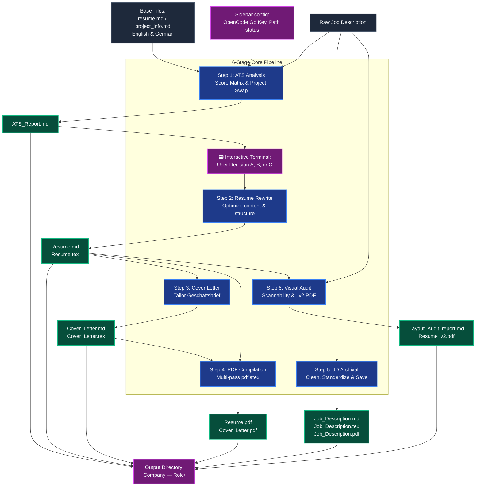

# ATS Resume Pipeline Streamlit App

A premium, production-grade **end-to-end resume tailoring and application optimization pipeline** built with Streamlit, the OpenCode Go API gateway (OpenAI-compatible client), and a local LaTeX compilation engine. This application automates the process of matching candidate qualifications to a target Job Description (JD) using a strict 6-stage algorithmic workflow calibrated for DACH region and global ATS systems, complete with an interactive terminal interface for real-time decisions.

---

### 🚀 Tech Stack & Integrations

<p align="left">
  
  
  
  
  
</p>

---

## 📸 Deployed Application Screenshots

Here are the screenshots demonstrating the live Streamlit application with the optimized multi-model and interactive decision pipeline:

<p align="center">
  
</p>

<br/>

<p align="center">
  
</p>

---

## 🗺️ Architectural Workflow

The application orchestrates complex prompt engineering, local file operations, string escaping, and double-pass compiler processes through the following data lifecycle:



---

## 🌟 Key Application Features

1. **Drag & Drop Base Files**: Overrides default base templates (`resume.md`, `project_info.md`) dynamically via the UI uploader with a robust automatic local file directory fallback if left empty.
2. **📟 Interactive Decision Terminal**: Uses a custom `st.session_state` state-machine to pause execution at the end of Step 1 if the calculated ATS score falls below the 85% benchmark. Presents a retro terminal-like text box inside the app, letting you enter your choice (A, B, or C) and dynamically injects it into Step 2 to guide the resume rewrite strategy.
3. **Sole OpenCode Go Specialization**: Focuses the pipeline entirely on **OpenCode Go** (`https://opencode.ai/zen/go/v1`) using the official OpenAI Python Client. Features:
   - Dynamic model discovery from the OpenCode Go API models endpoint.
   - Built-in fallback dropdown mapping exact allowed models (including `GLM-5.1`, `GLM-5`, `Kimi K2.6`, `Kimi K2.5`, `DeepSeek V4 Pro`, `Qwen3.7 Max`, `MiniMax M3`, `MiMo-V2.5-Pro`, etc.) in both direct slug and prefixed forms.
4. **WinError 123 Folder Sanitizer**: Cleans illegal Windows filename characters and strips instructional template text from LLM folder headers, falling back safely to a clean directory to prevent execution crashes.
5. **Custom Instructions Overrides**: Includes an optional Custom Prompt Instructions input field. If provided, your custom instructions will completely override the default pipeline skill files across all steps.

---

## 📑 The 6-Stage Optimization Blueprint

The core pipeline operates as a sequence of discrete steps, each backed by explicit domain engineering rules located in the pipeline definition files inside `ats-resume-pipeline/`.

### 1. ATS Analysis & Gap Detection (`01_ats_analysis.md`)
* **Objective:** Calibrate candidate experience against the target JD, scoring elements using a strict 0-100 matrix calibrated for the DACH region (Workday, SuccessFactors, Personio).
* **Key Tasks:**
  * Auto-detect the primary language of the Job Description.
  * Extract requirements strictly from candidate-facing profile segments.
  * Generate a **Scoring Table** (Keywords, Relevance, Tech Stack, Formatting, Soft Skills).
  * Devise an **Improvement Blueprint** and a **Project Swap Directive** stating which low-relevance resume projects to drop, and which verified projects from the portfolio to import (maintaining a target of 3-4 projects total).
  * Establish the company folder naming convention: `[Company Name] — [Job Role]`.

### 2. Resume Rewrite & LaTeX Mapping (`02_resume_rewrite.md`)
* **Objective:** Perform the physical rewrite of the resume matching the target language of the JD and map the tailored content to a custom Jake Ryan LaTeX layout framework.
* **Key Tasks:**
  * Apply the project swaps and technical skills tuning from Step 1.
  * Ensure no numeric prefixes exist in section headers.
  * **Typography Architecture:** Left-align the company name and right-align date blocks. Drop job titles to a dedicated newline in *small italics* (implemented via a `\\[2pt]` linebreak in LaTeX) to avoid horizontal layout overlaps.
  * Pair each project with its tool stack on the same line (`\resumeProject{...} \projectTools{...}`).

### 3. Cover Letter Generation (`03_cover_letter.md`)
* **Objective:** Draft a formal business cover letter adapted to the target language and structured under strict German business letter standards (*Geschäftsbrief*).
* **Key Tasks:**
  * Map layout headers: Sender Block (top left), Recipient Block, Date (right-aligned), and Bold Subject Line.
  * Limit body copy to a maximum of 4 paragraphs (250–300 words) tailored to fit cleanly on a single A4 page.
  * Ground assertions in metrics-driven evidence from the portfolio.
  * Explicitly weave in context: B1 German proficiency, research into local LLMs/RAGs, and Github portfolio links.

### 4. PDF Compilation (`04_pdf_compilation.md`)
* **Objective:** Automate local multi-pass `pdflatex` rendering for LaTeX sources and handle character-escaping anomalies.
* **Key Tasks:**
  * Pre-compilation sanitation: escape reserved characters (e.g., `&` ➔ `\&`, `%` ➔ `\%`, `_` ➔ `\_`, `$` ➔ `\$`).
  * Run a two-pass `pdflatex` process synchronously to resolve page splits, hypertargets, and dimension limits.
  * Sweep and delete intermediate build files (`.aux`, `.log`, `.out`).

### 5. Job Description Archival (`05_job_description_archival.md`)
* **Objective:** Clean and format raw JDs into high-quality reference assets for permanent offline archival.
* **Key Tasks:**
  * Strip cookie banners, application deadlines, tracker tags, and website navigation noise.
  * Format into standard clean markdown sections.
  * Generate a separate, error-free LaTeX representation using a corporate sans-serif style and compile it to PDF.

### 6. Visual Layout & Eye Test Audit (`06_visual_layout_and_eye_test.md`)
* **Objective:** Simulate a recruiter's 6-second scan to resolve visual ergonomic errors.
* **Key Tasks:**
  * Verify layout bounds and page splits (e.g., no orphaned headers at the bottom of pages).
  * Check bullet point density (restrict wrapping past a 2nd line).
  * Build a diagnostic table evaluating 6 layout metrics.
  * Generate an alternate `_v2.tex` file if refactoring is required and compile it to `Resume_v2.pdf` to allow easy visual comparison.

---

## 📂 Project Structure

```
ATS-Resume-Streamlit/
├── app.py                      # Main Streamlit Web Application
├── requirements.txt            # Python Dependencies
├── README.md                   # Application Documentation
└── ats-resume-pipeline/        # Pipeline Stage Specifications & Prompts
    ├── 01_ats_analysis.md      # Step 1: ATS Analysis specifications
    ├── 02_resume_rewrite.md    # Step 2: Resume Rewrite specifications
    ├── 03_cover_letter.md      # Step 3: Cover Letter specifications
    ├── 04_pdf_compilation.md   # Step 4: pdflatex Compilation specifications
    ├── 05_job_description_archival.md # Step 5: JD Archival specifications
    ├── 06_visual_layout_and_eye_test.md # Step 6: Eye Test Audit specifications
    └── SKILL.md                # Full Pipeline Orchestration details
```

---

## ⚙️ Prerequisites & Installation

### 1. LaTeX Compiler Installation
To compile PDF outputs, you need a local `pdflatex` installation added to your system's environment `PATH`:
* **Windows:** Install [MikTeX](https://miktex.org/download) or TeX Live. 
* Verify installation by running:
  ```powershell
  pdflatex --version
  ```

### 2. Base Portfolio Directory Structure (Fallback Backup)
The pipeline relies on reading base resume and project templates to perform its custom tailoring. If you do not drag-and-drop your base files in the UI, setup the directories as follows:
```
C:\Users\sagar\Documents\Claude Code JobSearch\Base Files\
├── English\
│   └── Markdown files\
│       ├── resume.md
│       └── project_info.md
└── German\
    └── Markdown Files\
        ├── resume.md
        └── project_info.md
```

### 3. Setup Python Environment
Clone this repository to your local machine, create a virtual environment, and install dependencies:
```powershell
# Create environment
python -m venv venv
.\venv\Scripts\Activate.ps1

# Install requirements
pip install -r requirements.txt
```

---

## 💻 Running the Streamlit App

Start the server using your local Streamlit CLI:
```powershell
streamlit run app.py
```

### Application Features
* **OpenCode Go Configurer**: Sidebar fields to quickly configure your OpenCode Go API key and target model.
* **Drag & Drop Base Files manager**: Drop markdown resumes and portfolio files right in the UI.
* **Live Sidebar Diagnostic:** Reviews the existence status of base files dynamically, checking session uploads first and fallback paths second.
* **Synchronized LLM Streaming:** Renders analysis reports and tailored documents in real-time.
* **Interactive Terminal UI**: Pause and capture choice inputs (A, B, or C) from your web page directly.
* **Dynamic Downloads Area:** Download PDF/markdown assets directly from the download grid interface.

---

## 🛠️ Troubleshooting & Common Fixes

### 1. LaTeX Package Failures
* **Error:** `pdflatex` reports a missing `.sty` or configuration file during Step 4.
* **Fix:** Open the **MikTeX Console**, run updates, and set the package installation option to *"Install missing packages on the fly"* or execute:
  ```powershell
  mpm --admin --install=[package-name]
  ```

### 2. Overfull `\hbox` or Margins Overflow
* **Error:** Text elements extend past page boundaries or cause formatting warnings.
* **Fix:** Step 6 will flag this during the audit stage. Refactor your project descriptions inside `project_info.md` to keep tools blocks and descriptions concise, avoiding multi-line tools wrapping.

### 3. Special Character Compilation Errors
* **Error:** The PDF compilation crashes with escaping errors (e.g., pointing to `&` or `_`).
* **Fix:** Ensure those characters are successfully processed in Step 4 and escaped appropriately. If problems persist, check for unescaped terms inside your raw `project_info.md` portfolio document.


---------------------------------------------------------------------------------------------------------