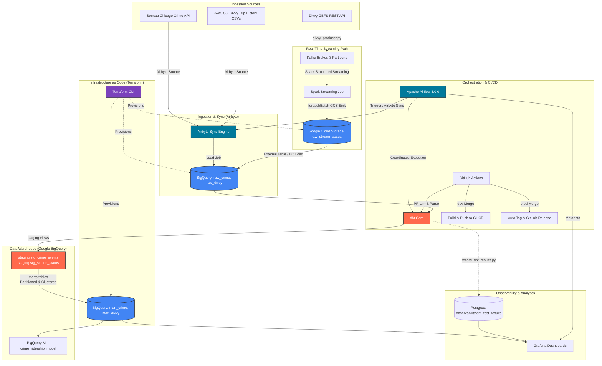

# Chicago Crime & Divvy Bike-Share Data Engineering Pipeline

[](https://www.docker.com/)
[](https://airflow.apache.org/)
[](https://spark.apache.org/)
[](https://kafka.apache.org/)
[](https://www.getdbt.com/)
[](https://cloud.google.com/)
[](https://www.terraform.io/)
[](https://grafana.com/)

An end-to-end cloud data engineering pipeline designed to investigate the relationship between Chicago crime patterns and Divvy bike-share ridership. The architecture implements a hybrid data ingestion pattern: a **batch ETL path** loading historical crime and ridership records (8M+ crime events, 50M+ Divvy trips) using **Airbyte** and **Apache Spark**, combined with a **real-time streaming path** capturing live bike station status updates via **Apache Kafka** and **Spark Structured Streaming**. Storage is centralized in **Google BigQuery** and Google Cloud Storage (GCS) provisioned using **Terraform** Infrastructure as Code (IaC), transformed with **dbt Core**, orchestrated via **Apache Airflow**, and continuously verified through **GitHub Actions** CI/CD pipelines.

---

## 🏗️ Architecture Diagram

The system architecture flows from diverse batch and stream sources to Google Cloud Platform, using dbt for in-warehouse modeling, Airflow for orchestration, and Grafana for real-time telemetry.



---

## 🛠️ Tech Stack

| Component | Technology | Shield / Logo | Purpose |
| :--- | :--- | :--- | :--- |
| **Cloud Infrastructure** | Google Cloud Platform |  | Primary cloud hosting for serverless data warehousing and storage. |
| **IaC Provisioning** | Terraform |  | Declarative cloud resource deployment (BigQuery datasets, GCS landing zones). |
| **Ingestion Engine** | Airbyte |  | Managed replication connectors extracting from Socrata and S3 into BigQuery. |
| **Batch Ingestion** | Socrata API |  | Ingestion endpoint returning historical Chicago Crime JSON records. |
| **Stream Ingestion**| GBFS REST API |  | Ingestion source for live bike-share station status JSON feeds. |
| **Message Broker** | Apache Kafka |  | Distributed event streaming broker managing station updates via partitions. |
| **Batch Processing**| Apache Spark |  | High-speed processing of Parquet staging files into raw schemas. |
| **Stream Processing**| Spark Structured Streaming |  | Real-time streaming consumer sinking Kafka event streams into GCS. |
| **Orchestration** | Apache Airflow |  | DAG scheduling, backfills, execution-timeout tracking, and callbacks. |
| **Warehouse** | Google BigQuery |  | Serverless cloud data warehouse with partitioned/clustered analytics marts. |
| **Machine Learning**| BigQuery ML |  | Serverless SQL-based regression model building and feature weight checks. |
| **Transformation**| dbt (data build tool) |  | Modular SQL transformation, dimensional modeling, and schema test automation. |
| **CI/CD** | GitHub Actions |  | Automated workflows for code quality, Docker registry pushes, and releases. |
| **Observability** | Grafana |  | Interactive dashboard displaying pipeline metrics and correlation scatter plots. |
| **Containerization**| Docker & Compose |  | Local runtime isolation for Airflow, Kafka, Spark, and Postgres metadata. |

---

## 🔄 Pipeline Overview

The modern ELT pipeline handles massive analytical scale by separating extraction, storage, and transformation:

1. **Infrastructure Provisioning (Terraform)**:
   - Declarative scripts configure Google Cloud resources. Terraform provisions GCS data lakes, separates BigQuery datasets (`raw`, `staging`, `mart`), sets permissions, and manages state securely in a cloud backend.
2. **Ingestion & Storage (Airbyte & Spark)**:
   - **Batch Crime Ingestion**: Airbyte's Socrata connector pulls 8M+ historical records from the Chicago Data Portal directly into BigQuery raw tables.
   - **Batch Ridership Ingestion**: Airbyte extracts monthly historical Divvy trip CSV files (~50M rows) from an AWS S3 bucket (`divvy-tripdata.s3.amazonaws.com`) and loads them incrementally into BigQuery.
   - **Live Ingestion**: A Python producer polls GBFS status feeds every 60 seconds, publishing messages to a 3-partition Kafka topic (keyed by `station_id` to guarantee ordering). A Spark Structured Streaming consumer reads the stream and writes micro-batches to a GCS bucket, which BigQuery exposes as an external staging table.
3. **Data Warehouse Transformations (dbt)**:
   - Staging models cast types, rename fields, and deduplicate on primary keys.
   - Mart models construct a highly-optimized star schema in BigQuery:
     - `dim_date`: Unified dimension covering both historical crime and streaming ranges.
     - `dim_community_area`: Seed-backed lookup for Chicago's 77 community areas.
     - `dim_crime_type`: Casing-normalized taxonomy of crime classifications.
     - `fact_crime_events`: Geolocation-enriched fact representing crime events.
     - `fact_station_reads`: Granular logs capturing real-time bike capacities.
     - `fact_station_day`: Daily rolls aggregating rides and nearby crimes.
4. **Performance Optimization (BigQuery Tuning)**:
   - **Partitioning**: The `fact_crime_events` and ridership tables are partitioned by date (`date` / `started_at`), enabling partition pruning to minimize scanned bytes.
   - **Clustering**: Tables are clustered by `community_area` and `start_station_id`, optimizing query performance and reducing scan costs for geospatial filters.
5. **Analytics & BigQuery ML**:
   - The driving question is answered using a geospatial join on BigQuery, matching station coordinates with crimes committed within a quarter-mile radius on the same day:
     ```sql
     ST_DISTANCE(ST_GEOGPOINT(station_lon, station_lat), ST_GEOGPOINT(crime_lon, crime_lat)) <= 402
     ```
   - BigQuery ML trains a linear regression model (`mart.crime_ridership_model`) directly in the warehouse using SQL, evaluating weights (`ML.WEIGHTS`) to measure the impact of local crime metrics on bike-share ridership.

---

## 📂 Project Structure

```
chicago-data-pipeline/
├── .github/
│   └── workflows/
│       ├── ci.yml              # PR validation check workflow (Ruff, dbt, Compose)
│       ├── build.yml           # dev branch build workflow pushing images to GHCR
│       └── release.yml         # prod branch tagging & GitHub Release workflow
├── docker-compose.yml          # Container definitions for local development
├── .env.example                # Config environment variables template
├── Makefile                    # Developer execution shortcuts
├── pyproject.toml              # uv virtual environment config
├── uv.lock                     # Locked host dependencies
├── init.sql                    # Local Postgres database schema setup script
│
├── ingestion/                  # Hand-rolled local ingestion scripts
│   └── download_crime.py       # Chicago Crime API -> Parquet downloader (local dev)
│
├── spark/
│   ├── Dockerfile              # Spark base image baked with JDBC & Kafka JARs
│   ├── entrypoint.sh           # Named volume permissions fix script
│   └── jobs/
│       ├── crime_batch.py      # Spark batch job (Parquet -> Postgres Raw / GCS)
│       └── divvy_stream.py     # Spark streaming job (Kafka -> Postgres Raw / GCS)
│
├── kafka/
│   └── producers/
│       └── divvy_producer.py   # GBFS API -> Kafka broker publisher
│
├── airflow/
│   ├── Dockerfile              # Airflow base image baked with Docker CLI
│   ├── requirements.txt        # Container python provider dependencies
│   ├── passwords.json          # Airflow 3.0 SimpleAuthManager passwords
│   ├── dags/
│   │   ├── crime_batch_dag.py  # Historical crime batch run DAG
│   │   ├── divvy_stream_dag.py # Real-time streaming control loop DAG
│   │   └── callbacks.py        # Failure logging alert hook
│   └── scripts/
│       └── record_dbt_results.py # Parses dbt test outcomes into Postgres
│
├── dbt/
│   ├── dbt_project.yml         # Global dbt configuration
│   ├── profiles.yml            # Postgres and BigQuery warehouse profiles
│   ├── seeds/
│   │   └── community_areas.csv # Static Chicago community area mappings seed
│   ├── macros/
│   │   ├── generate_schema_name.sql # Custom schema name dispatcher
│   │   └── try_cast.sql        # Portability safe cast macro (Postgres/BigQuery)
│   ├── models/
│   │   ├── staging/
│   │   │   ├── stg_crime_events.sql   # Crime events staging SQL (BigQuery-ready)
│   │   │   ├── stg_station_status.sql # Divvy station status staging SQL (BigQuery-ready)
│   │   │   └── schema.yml             # Staging constraints and null checks
│   │   └── marts/
│   │       ├── dim_date.sql           # Shared date dimension UNIONing ranges
│   │       ├── dim_community_area.sql # Seed-backed community area dimension
│   │       ├── dim_crime_type.sql     # Categorized crime mapping dimension
│   │       ├── fact_crime_events.sql  # Mart fact table for Chicago crime events
│   │       ├── fact_station_reads.sql # Mart fact table for bike station availability reads
│   │       ├── fact_station_day.sql   # Aggregate daily ridership & nearby crime count table
│   │       ├── crime_ridership_correlation.sql # Geospatial join calculating CORR coefficient
│   │       └── schema.yml             # Data quality validations and relationship rules
│   └── tests/
│       └── assert_crime_in_chicago_bounds.sql # Singular coordinate validation test
│
├── terraform/                  # Cloud infrastructure IaC
│   ├── main.tf                 # Declares GCS buckets and BigQuery dataset resources
│   ├── variables.tf            # Configures GCP project and region variables
│   ├── outputs.tf              # Exposes resource URIs and dataset IDs
│   └── providers.tf            # Locks Terraform core and Google Provider versions
│
└── grafana/
    ├── provisioning/
    │   ├── datasources/
    │   │   └── postgres.yml    # Analytics and Airflow metadata datasources
    │   └── dashboards/
    │       └── dashboards.yml  # Autoloading dashboard configs
    └── dashboards/
        ├── pipeline_health.json # 11-panel pipeline health dashboard
        └── crime_divvy_analysis.json # 6-panel analysis dashboard
```

---

## 🚀 How to Run & Deploy

### 1. Local Development (Docker Compose)
Spin up the local containerized cluster to verify orchestration, streaming, and dbt models on a Postgres database:
```bash
# Build custom Airflow, Spark, and dbt images
docker compose build

# Start database and run schema migrations
docker compose up -d postgres airflow-init

# Start orchestration, brokers, and streaming jobs
docker compose up -d
```
Access the local monitoring interfaces:
- **Airflow Webserver**: [http://localhost:8080](http://localhost:8080) (Credentials: `admin` / `admin`)
- **Spark Master UI**: [http://localhost:8180](http://localhost:8180)
- **Grafana UI**: [http://localhost:3000](http://localhost:3000)

### 2. Cloud Provisioning (GCP & Terraform)
Authenticate with your Google Cloud project and apply Terraform scripts to provision resources:
```bash
cd terraform
terraform init
terraform plan -out=tfplan
terraform apply tfplan
```
*This deploys GCS buckets (acting as landing zone data lakes) and BigQuery datasets (`raw_crime`, `raw_divvy`, `staging`, `mart`).*

### 3. Managed Ingestion & Transformation (Airbyte & dbt)
1. **Sync Data**: Configure the Airbyte connection to sync the Socrata Crime API and S3 Divvy Trip CSVs directly into BigQuery.
2. **Execute dbt Models**: Run and test the BigQuery profile models:
   ```bash
   cd dbt
   dbt deps
   dbt build --target prod
   ```

---

## 🧪 Data Quality, Robustness & CI/CD Gates

### A. Automated CI/CD Workflows (GitHub Actions)
Our DevOps architecture implements a 3-stage automation pipeline:
- **Workflow 1: CI Checks (PRs to `dev` / `prod`)**:
  - Code linting via `ruff check` on all Python files.
  - dbt SQL compilation and model validation via `dbt parse`.
  - Docker Compose validation via `docker compose config -q`.
  - Multi-stage image build checks to catch compilation issues.
- **Workflow 2: Build & Push (Merge to `dev`)**:
  - Builds and tags development images (e.g. `airflow:dev`, `spark:dev`, `dbt:dev`).
  - Pushes images to the GitHub Container Registry (GHCR) for deployment.
- **Workflow 3: Release (Merge to `prod`)**:
  - Automates semantic version bumping (`v{MAJOR}.{MINOR}.{PATCH}`) based on commit logs.
  - Tags the merge commit and publishes a GitHub Release with auto-generated release notes.
  - Compiles, tags, and pushes production-grade versioned images to GHCR.

### B. In-Warehouse Data Quality
- **Schema Assertions**: Unique constraints, non-null properties, and relationship integrity validations.
- **Singular Tests**: Geolocation bounds check (`assert_crime_in_chicago_bounds.sql`) isolating coordinates outside the city limits.

### C. Airflow Pipeline Fault-Tolerance
- **SqlSensor Gating**: A sensor checks for the existence of raw tables before transformation tasks run, resolving race conditions between batch and streaming models.
- **Resilience**: Task retries (`retries=3`), 5-minute retry intervals, execution timeouts (`execution_timeout=30m`), and failure callbacks logging structured context JSON.

---

## 📈 Modules Status

Our complete pipeline status:

| Phase | Feature/Module | Status | Details |
| :--- | :--- | :--- | :--- |
| **Phase 1** | **Parquet Ingestion (Crime)** | 🟢 Complete | Batch ingestion of Chicago Crime Socrata API to local Parquet. |
| **Phase 1** | **Spark Batch Job** | 🟢 Complete | PySpark batch cleaning and JDBC insertion to PostgreSQL. |
| **Phase 1** | **dbt Staging & Mart Models** | 🟢 Complete | Staging, dimension, and fact tables running locally. |
| **Phase 1** | **Airflow Batch DAG** | 🟢 Complete | Scheduled DAG executing downloader, Spark, and dbt. |
| **Phase 2** | **Kafka Message Broker** | 🟢 Complete | Zookeeper and Confluent Kafka services configured via Compose. |
| **Phase 2** | **Kafka Divvy Producer** | 🟢 Complete | Polled GBFS updates published to keyed Kafka partitions. |
| **Phase 2** | **Spark Structured Streaming** | 🟢 Complete | Spark Structured Streaming processing Kafka to Postgres. |
| **Phase 2** | **Airflow Streaming DAG**| 🟢 Complete | Scheduled stream start, producer, and cleanup DAG task flows. |
| **Phase 3** | **Grafana Provisioning** | 🟢 Complete | Automatic setup of 2 dashboards and PostgreSQL datasources. |
| **Phase 3** | **dbt Test Logging** | 🟢 Complete | Hook script loading dbt run results into Postgres. |
| **Phase 3** | **Pipeline Robustness** | 🟢 Complete | Implemented SqlSensors, execution timeouts, retries, and callback logs. |
| **Phase 4** | **Terraform IaC** | 🟢 Complete | Provisioned datasets, GCS buckets, and cloud state backend. |
| **Phase 4** | **Airbyte Ingestion** | 🟢 Complete | Crime API and S3 trip CSVs synced to BigQuery. |
| **Phase 4** | **BigQuery Performance Tuning**| 🟢 Complete | Partitioning and clustering dbt models for scan-cost reduction. |
| **Phase 4** | **Analytics & BigQuery ML** | 🟢 Complete | Geospatial queries, CORR metrics, and BQML linear regression. |
| **Phase 5** | **CI Checks & Checks** | 🟢 Complete | Ruff linting, dbt parsing, and YAML validations on PR. |
| **Phase 5** | **GHCR Image Registry** | 🟢 Complete | Pushing development and production Docker images to GHCR. |
| **Phase 5** | **Semantic Release & Versioning**| 🟢 Complete | Automated version tagging and GitHub Release generation. |

*Legend: 🟢 Complete | 🚧 In Progress | 🔲 Planned*

---

## 👤 Author

* **Sagar Marthandan**
* **GitHub**: [github.com/SagarMarthandan](https://github.com/SagarMarthandan)
* **Email**: sagar@example.com
