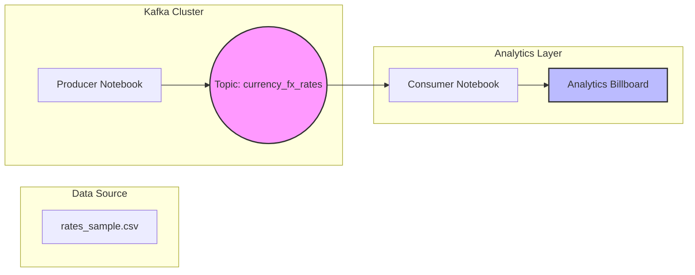

# Kafka FX Rates: Batch vs Stream Processing Walkthrough

[](https://kafka.apache.org/)
[](https://www.python.org/)
[](https://jupyter.org/)
[](https://pandas.pydata.org/)

This project demonstrates a **Kafka-driven data pipeline** designed to process Foreign Exchange (FX) rates. It highlights how Kafka can be leveraged to move data from static batch files to real-time consumers for analytics and monitoring.

---

## 🏗️ System Architecture

The following diagram illustrates the flow of currency data from a CSV source to a live analytics "billboard" via Kafka.



---

## 🚀 How to Run

Follow these steps to set up the Kafka environment and run the processing tool.

### 1. Start Services

Open your terminal in the Kafka installation directory (e.g., `C:\kafka\bin\windows`) and run:

| Step             | Command                                                        |
| :--------------- | :------------------------------------------------------------- |
| **Zookeeper**    | `zookeeper-server-start.bat ..\..\config\zookeeper.properties` |
| **Kafka Server** | `kafka-server-start.bat ..\..\config\server.properties`        |

### 2. Configure Topics

Create the necessary topic for FX rates:

```bash
kafka-topics.bat --create --topic currency_fx_rates --bootstrap-server localhost:9092 --partitions 1 --replication-factor 1
```

### 3. Run the Pipeline

1.  **Start the Producer**: Run `producer_360T.ipynb`. This reads `rates_sample.csv` and streams the data to Kafka.
2.  **Start the Consumer**: Run `consumer_360T.ipynb`. This consumes the data and calculates percentage changes against "Yesterday's 5 PM Rate".

---

## 🧠 Project Logic

### 📤 Producer (`producer_360T.ipynb`)

- **Function**: Ingests `rates_sample.csv`.
- **Logic**: Iterates through each FX event, serializes it to JSON, and publishes it to the `currency_fx_rates` topic.
- **Mechanism**: Uses a `KafkaProducer` with a 1-second delay between messages to simulate a steady stream of data.

### 📥 Consumer (`consumer_360T.ipynb`)

- **Function**: Real-time Analytics Engine.
- **Logic**:
  - Listens to the Kafka topic.
  - Compares the current rate against a hardcoded `previous_day_rates` dictionary.
  - Calculates the **Percentage Change**.
- **Output**: Renders a "Billboard" in the terminal showing the pair, current rate, and trend.

---

## 🔄 Kafka: Stream vs Batch Processing

This project sits at the intersection of Batch and Stream processing. Here is how they differ in the context of Kafka:

| Feature          | 📦 Batch Processing                                  | 🌊 Stream Processing (Used Here)                      |
| :--------------- | :--------------------------------------------------- | :---------------------------------------------------- |
| **Data Arrival** | Collected over a period, then processed all at once. | Processed immediately as individual events occur.     |
| **Latency**      | High (Minutes to Hours).                             | Ultra-Low (Milliseconds to Seconds).                  |
| **Source**       | Large files (CSV, Parquet) or Databases.             | Real-time events, sensors, or app logs.               |
| **Kafka Role**   | Storing historical logs for later analysis.          | Acting as the "central nervous system" for live data. |

> [!TIP]
> **Why Kafka?** Kafka allows us to turn static files into a high-throughput stream, making it easy to scale the analytics layer without modifying the data source.

---

## 📂 Structure

- `producer_360T.ipynb`: Logic to push data to Kafka.
- `consumer_360T.ipynb`: Logic to process data and show analytics.
- `rates_sample.csv`: Sample FX data source.
- `kafka commands.txt`: Cheat sheet for Kafka operations.


-------------------------------------------------------------------------------------