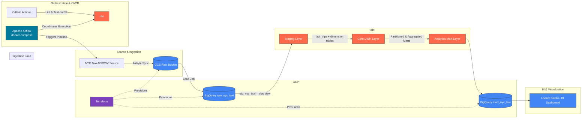

# NYC Taxi Analytics Pipeline (2025)

An end-to-end modern data engineering pipeline designed to ingest, orchestrate, store, transform, and analyze the monthly **NYC Taxi Trip Records (2025)** dataset. Built to scale, this pipeline provisions cloud infrastructure as code, automates ingestion and orchestration, establishes modular data warehouse layers, and enforces high-standard data quality checks.

---

## 🏗️ Architecture Diagram

The system architecture flows from source to analytics, utilizing ELT (Extract, Load, Transform) principles. All orchestration and local processing are containerized.



---

## 🛠️ Tech Stack

| Component | Technology | Shield / Logo | Purpose |
| :--- | :--- | :--- | :--- |
| **Ingestion** | Airbyte |  | Replicating taxi data from CSV/API sources into BigQuery. |
| **Orchestration** | Apache Airflow |  | DAG workflow orchestration, scheduling, and error handling. |
| **Warehouse** | Google BigQuery |  | Serverless cloud data warehouse scaling for petabytes of data. |
| **Transformation**| dbt (data build tool) |  | Transforming raw tables into staging views, dimensions, facts, and marts. |
| **Infrastructure**| Terraform |  | Declarative GCP infrastructure provisioning (GCS buckets, datasets). |
| **Containerization**| Docker & Compose |  | Local isolated runtime environments for Airflow and Postgres databases. |
| **CI/CD** | GitHub Actions |  | CI pipelines to automate SQL lints (SQLFluff) and tests on PR. |
| **Languages** | Python, SQL, Jinja |  | Core pipeline logic, analytics SQL transformations, and dbt macros. |

---

## 🔄 Pipeline Overview

The pipeline executes a modern ELT architecture split into clear, decoupled stages:
1. **Infrastructure Provisioning**: Terraform deploys secure GCS landing zones, BigQuery datasets, and enforces access control rules.
2. **Ingestion & Loading (E & L)**: Airflow triggers the **Airbyte Connection** configuration to replicate CSV files from the NYC Taxi API into Google Cloud Storage, which is immediately loaded into BigQuery `raw_nyc_taxi` datasets.
3. **Orchestration**: Apache Airflow schedules monthly runs, handling backfills, triggering data load routines, and executing downstream transformation tasks.
4. **Transformations (T)**:
   - **Staging Layer**: Raw fields are selected, properly typed, and cast using clean SQL patterns. Anomalous rows (such as dates outside of 2025 or negative totals) are filtered out.
   - **Core Layer**: Formats a star schema. `dim_location` loads geographic mappings, `dim_payment_type` decodes transaction codes, `dim_vendor` outlines TPEP providers, and `fact_trips` consolidates sanitized transactions.
   - **Marts Layer**: Analytical tables optimized for business intelligence dashboards (e.g. route performance averages and daily surges).

---

## 📂 Project Structure

Below is the complete, modular folder structure designed around production data engineering best practices.

```
ny-taxi-pipeline-2025/
├── .github/
│   └── workflows/
│       └── ci.yml               # CI pipeline for dbt linting and test runs on PR
├── airbyte/
│   └── connection_nyc_taxi.json # Airbyte replication connector configuration JSON
├── airflow/
│   ├── dags/
│   │   └── dag_nyc_taxi_ingestion.py # Orchestrator DAG for ingestion and dbt runs
│   ├── plugins/
│   │   └── .gitkeep             # Reserved directory for custom Airflow hooks/operators
│   ├── docker-compose.yml       # Local container cluster definitions for Airflow & Postgres
│   └── .env.example             # Example environment file (used for setup; never committed)
├── dbt/
│   ├── macros/
│   │   └── get_payment_type_description.sql # Jinja macro to decode payment types
│   ├── models/
│   │   ├── core/
│   │   │   ├── dim_location.sql # Geographic zone dimension
│   │   │   ├── dim_payment_type.sql # Payment method dimension
│   │   │   ├── dim_vendor.sql   # TPEP provider company dimension
│   │   │   ├── fact_trips.sql   # Consolidated transactions fact table
│   │   │   └── schema.yml       # Documentation & tests for the core layer
│   │   ├── marts/
│   │   │   ├── mart_hourly_demand.sql # Surge pattern & weekday hour metrics
│   │   │   ├── mart_monthly_trip_summary.sql # Aggregate monthly averages
│   │   │   ├── mart_payment_type_breakdown.sql # Payment slice & revenue share percentages
│   │   │   ├── mart_route_performance.sql # Geographic route flows & absolute fares
│   │   │   └── schema.yml       # Documentation & tests for the marts layer
│   │   └── staging/
│   │       ├── schema.yml       # Declares raw sources and basic staging validations
│   │       └── stg_nyc_taxi__trips.sql # Initial data casting and sanitization view
│   ├── seeds/
│   │   └── taxi_zone_lookup.csv # Static seed file mapping Location IDs to Boroughs
│   ├── tests/
│   │   └── assert_trip_fare_is_positive.sql # Custom validation asserting positive fares
│   ├── dbt_project.yml          # Global dbt project settings and materializations
│   └── profiles.yml             # Connection definitions for Google BigQuery
├── terraform/
│   ├── main.tf                  # Declares GCS buckets and BigQuery dataset resources
│   ├── outputs.tf               # Exposes resource URLs and dataset IDs
│   ├── providers.tf             # Locks Terraform core and Google Provider versions
│   └── variables.tf             # Houses configurable pipeline variables
├── .gitignore                   # Excludes secret keys, local environments, and target logs
├── Makefile                     # Developer shortcuts for Docker, dbt, and Terraform commands
├── README.md                    # Professional documentation index
└── requirements.txt             # Required Python package dependencies for local work
```

---

## 🚀 How to Run Locally

Get the entire environment up and running in a few simple commands:

### 1. Prerequisite Checklist
- Installed [Docker Desktop](https://www.docker.com/products/docker-desktop/) and Compose.
- Installed [Terraform CLI](https://developer.hashicorp.com/terraform/install).
- A Google Cloud Platform (GCP) Account with an active project, and a Service Account JSON key saved locally as `gcp-service-account.json`.

### 2. Clone the Repository
```bash
git clone https://github.com/SagarMarthandan/ny-taxi-pipeline-2025.git
cd ny-taxi-pipeline-2025
```

### 3. Configure Local Environments
Initialize local environment files by running the following Makefile task:
```bash
make init
```
*This copies `airflow/.env.example` to `airflow/.env` and builds the custom Airflow Docker images.*
> [!IMPORTANT]
> Move your `gcp-service-account.json` key into the `airflow/keys/` directory to allow containers to authenticate with BigQuery.

### 4. Provision GCP Infrastructure
Authenticate with GCP, then navigate to Terraform to plan and provision resources:
```bash
make tf-init
make tf-plan
make tf-apply
```

### 5. Spin Up the Airflow Container Cluster
Start the Airflow webserver, scheduler, and PostgreSQL metadata backend:
```bash
make up
```
Check the healthy status of your services by accessing the Airflow Webserver UI:
- **URL**: `http://localhost:8080`
- **Username / Password**: `admin / admin`

### 6. Execute Transformations and Tests Manually
If you want to run or test dbt models directly outside the scheduled Airflow DAGs:
```bash
# Install packages
make dbt-deps

# Transform and compile models
make dbt-run

# Run data quality tests
make dbt-test
```

### 7. Tear Down Cluster
When finished, stop and purge all Docker volumes:
```bash
make down
```

---

## 🔮 dbt Models Overview

Our dbt model configurations utilize structural layer separation (Staging → Core → Marts) for clean DAG lineage:

```
            [ raw_nyc_taxi.yellow_tripdata_2025 ]
                             │
                             ▼  (View Materialization)
                [ stg_nyc_taxi__trips ]
                             │
            ┌────────────────┴────────────────┐
            ▼ (Table)                         ▼ (Seed)
      [ fact_trips ] ◄────────────────── [ dim_location ]
            │                                 │
            │◄───────── [ dim_payment_type ]  │
            │◄───────── [ dim_vendor ]        │
            │
  ┌─────────┴──────────┬──────────────────────┬─────────────────────────┐
  ▼ (Table)            ▼ (Table)              ▼ (Table)                 ▼ (Table)
[ mart_monthly_ ]    [ mart_route_ ]        [ mart_payment_ ]         [ mart_hourly_ ]
[ trip_summary  ]    [ performance ]        [ type_breakdown]         [ demand       ]
```

* **Staging Layer (`staging/`)**: Materialized as lightweight virtual `views`. Houses `stg_nyc_taxi__trips.sql`, doing column renaming, converting fields, casting data types, and filtering out outlier dates.
* **Core Layer (`core/`)**: Materialized as solid, durable physical `tables`. Houses `dim_location.sql` (geographic metadata mapping), `dim_payment_type.sql` (decoding categories), `dim_vendor.sql` (provider metadata), and `fact_trips.sql` (joins trips and maps keys to deterministic surrogate IDs).
* **Marts Layer (`marts/`)**: Materialized as high-performance physical analytics tables to serve BI aggregates directly:
  - `mart_monthly_trip_summary.sql`: Roll-ups of total rides, consolidated revenue sums, and averages of distances, passenger totals, and tip values.
  - `mart_route_performance.sql`: Route patterns mapping pickup and dropoff zones and boroughs alongside transaction count weights, total revenues, and ride averages.
  - `mart_payment_type_breakdown.sql`: Revenue slice breakdown by method, incorporating tipping trends and percentage share shares computed via window operations.
  - `mart_hourly_demand.sql`: Temporal aggregates grouping rides by the hour (0-23) and weekday name (Monday-Sunday) to spot surge patterns.

---

## 🧪 Data Quality Checks

Data quality is treated as a first-class citizen in this architecture, combining built-in schema tests with custom assertions:

### A. Out-of-the-Box Schema Validation
Declared in staging, core, and marts `schema.yml` configurations:
* **`not_null`**: Enforced on primary keys (`location_id`, `trip_id`), timestamps (`pickup_datetime`), and critical identifiers.
* **`unique`**: Enforces strict unique constraints on geographic location keys (`location_id` in `dim_location`) and primary keys in payment dimensions.
* **`accepted_values`**: Declares bounds on fields. For example, `hour_of_day` is validated inside standard hours `[0-23]`, and `day_of_week` strictly permits standard weekdays.

### B. Custom Singular Assertions
* **`assert_trip_fare_is_positive`**: A custom SQL test located in the `tests/` directory. It selects records where the base `fare_amount` drops below zero. If any records are returned, the test fails, preventing bad transformations from merging to production.

---

## 📈 Modules Status

Our pipeline modules build progress is summarized below:

| Feature/Module | Status | Details |
| :--- | :--- | :--- |
| **Airbyte Connector Config** | 🟢 Done | Replicates NYC Taxi CSV into raw BigQuery schemas. |
| **Airflow DAGs** | 🟢 Done | Configured scheduler pipelines and manual task operators. |
| **GCP Provisioning** | 🟢 Done | Terraform main, variables, and outputs fully mapped. |
| **dbt Staging Models** | 🟢 Done | Views and cleaning filters implemented. |
| **dbt Core Models** | 🟢 Done | Location, Vendor, and Payment dimensions running on BigQuery. |
| **dbt Mart Layer** | 🟢 Done | All 4 analytical tables (Monthly, Routes, Payments, Hourly) built. |
| **dbt Test Suite Expansion** | 🟢 Done | Implemented schema tests and singular positive fare checks. |
| **CI/CD Pipeline** | 🚧 In Progress | Setting up GitHub Actions linter and automatic tests on PR. |
| **BI Integration** | 🔲 Planned | Looker Studio dashboard setup for route heatmaps. |

*Legend: 🟢 Done | 🚧 In Progress | 🔲 Planned*

---

## 👤 Author

* **Sagar Marthandan**
* **GitHub**: [github.com/SagarMarthandan](https://github.com/SagarMarthandan)
* **Email**: sagar@example.com


------------------------------------------------------------------------------------