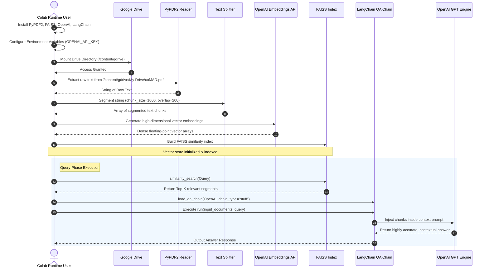

# Retrieval-Augmented Generation (RAG) PDF Query System

[](https://www.python.org/)
[](https://github.com/hwchase17/langchain)
[](https://openai.com/)
[](https://github.com/facebookresearch/faiss)
[](https://colab.research.google.com/)

A highly efficient, end-to-end **Retrieval-Augmented Generation (RAG)** pipeline designed to ingest, process, and query dense PDF documents using LLMs. This system mounts a Google Drive filesystem, extracts and partitions text contents from academic or commercial PDFs, indexes them into a highly optimized local vector database (**FAISS**), and handles domain-specific context retrieval to answer complex user queries with high fidelity.

---

## 🧭 System Architecture & Workflow

The architecture utilizes a two-phase workflow: **Data Ingestion & Indexing** and **Retrieval & Answer Generation**.

### 1. Unified RAG Architecture Diagram

The diagram below outlines how unstructured PDF data transitions into vector representations, resides in FAISS, and gets dynamically retrieved to supplement the LLM's prompt.

```mermaid
graph LR
    %% Styling Configuration
    classDef ingest fill:#e3f2fd,stroke:#1565c0,stroke-width:2px,color:#0d47a1;
    classDef process fill:#f3e5f5,stroke:#7b1fa2,stroke-width:2px,color:#4a148c;
    classDef store fill:#efebe9,stroke:#5d4037,stroke-width:2px,color:#3e2723;
    classDef query fill:#e8f5e9,stroke:#2e7d32,stroke-width:2px,color:#1b5e20;
    classDef llm fill:#fff3e0,stroke:#ef6c00,stroke-width:2px,color:#e65100;

    subgraph Data_Ingestion ["1. Ingestion Phase"]
        A["📄 PDF Document<br>(coMAD.pdf)"]:::ingest -->|Google Drive Mount| B["📥 PyPDF2 Reader"]:::ingest
        B -->|Extract Text| C["⚙️ Raw Text Buffer"]:::ingest
    end

    subgraph Document_Processing ["2. Processing Phase"]
        C -->|Unstructured Text| D["✂️ CharacterTextSplitter<br>(Chunk: 1000, Overlap: 200)"]:::process
        D -->|Structured Text Chunks| E["🧠 OpenAI Embeddings<br>(text-embedding-ada-002)"]:::process
    end

    subgraph Vector_DB ["3. Storage Phase"]
        E -->|High-Dim Embeddings| F[("⚡ FAISS Local Index<br>(IndexFlatL2 similarity)")]:::store
    end

    subgraph Query_Chain ["4. Retrieval & Generation Phase"]
        G["👤 User Query"]:::query -->|Semantic Search| H["🔍 Vector Similarity Search"]:::query
        F -.->|Retrieve Top K Matches| H
        H -->|Context Document Chunks| I["🔗 LangChain QA Chain<br>(Stuff Document Chain)"]:::llm
        G -->|User Question| I
        J["🤖 OpenAI LLM<br>(GPT Engine)"]:::llm <-->|Generate Synthesized Response| I
        I -->|Precise Grounded Answer| K["💬 Output Answer"]:::query
    end
```



### 2. Execution Sequence Flow

The interaction matrix below details the execution lifecycle from loading package dependencies to producing the final synthesized response:



---

## 🛠️ Tech Stack & Library Rationale

The system relies on a modular, enterprise-grade AI stack to guarantee lightning-fast query-to-retrieval latency.

| Technology                                                                             | Role / Purpose           | Description & Rationale                                                                                      |
| :------------------------------------------------------------------------------------- | :----------------------- | :----------------------------------------------------------------------------------------------------------- |
| **[Python 3.10+](https://www.python.org/)**                                            | Runtime Engine           | Base language utilizing optimized numerical and vector computing features.                                   |
| **[LangChain](https://github.com/hwchase17/langchain)**                                | AI Orchestrator          | Facilitates prompt compilation, document chunk injection, and chaining mechanisms.                           |
| **[OpenAI Embeddings](https://platform.openai.com/docs/guides/embeddings)**            | Vector Representation    | Translates textual vocabulary into a high-dimensional mathematical space where semantic similarities align.  |
| **[FAISS (Facebook AI Similarity Search)](https://github.com/facebookresearch/faiss)** | Vector Database          | Highly optimized C++ backend wrapper enabling ultra-fast nearest-neighbor calculations (L2/Cosine distance). |
| **[PyPDF2](https://pypi.org/project/PyPDF2/)**                                         | Document Parsing         | Extracts binary characters and raw strings from PDF streams.                                                 |
| **[TikToken](https://github.com/openai/tiktoken)**                                     | Byte-Pair Encoding (BPE) | Counts, monitors, and validates OpenAI token lengths to fit within context window limits.                    |

---

## 📂 Code Structure & Notebook Walkthrough

The notebook [`PDF_Query_LLM.ipynb`](./PDF_Query_LLM.ipynb) is organized into standard executable workflow blocks:

### 1. Installation & Environment Configuration

```python
!pip install langchain openai PyPDF2 faiss-cpu tiktoken
```

Downloads lightweight system libraries onto the Colab runtime environment, ensuring FAISS is compiled with CPU-compatibility.

### 2. Dependency Loading

Imports essential classes for text parsing (`PdfReader`), semantic partitioning (`CharacterTextSplitter`), and dense vector storage search (`FAISS`).

### 3. Identity & Credentials Management

```python
import os
os.environ["OPENAI_API_KEY"] = "sk-..."
```

Provides credentialing to authorize communication with OpenAI API engines.

### 4. File Source Ingestion & Extraction

```python
from google.colab import drive
drive.mount('/content/gdrive', force_remount=True)
reader = PdfReader('/content/gdrive/My Drive/coMAD.pdf')
```

Mounts the developer's personal Google Drive folder, establishes an active document reader stream pointing to the target PDF (`coMAD.pdf`), and traverses every page of the document to extract ASCII strings into a consolidated `raw_text` variable.

### 5. Semantic Chunking & Structuring

```python
text_splitter = CharacterTextSplitter(
    separator = "\n",
    chunk_size = 1000,
    chunk_overlap  = 200,
    length_function = len,
)
texts = text_splitter.split_text(raw_text)
```

Splits the long continuous raw text block into overlapping chunks of 1000 characters. The **200-character overlap** ensures that context boundaries are preserved, preventing semantic separation of ideas split across arbitrary page limits.

### 6. Local Index Seeding

```python
embeddings = OpenAIEmbeddings()
docsearch = FAISS.from_texts(texts, embeddings)
```

Computes structural embedding vectors for all text blocks using the OpenAI API and injects the resulting vectors into a local FAISS database, preparing the indices for sub-millisecond querying.

### 7. Conversational QA Retrieval

Loads LangChain's pre-configured `stuff` document chain. When queried, FAISS conducts semantic similarity searches, recovers the most representative segments, injects them directly into the LLM system prompt, and yields answers to detailed textual inquiries.

---

## 🚀 Getting Started & Local Setup

To execute this codebase within your local Python environment rather than Google Colab, follow these steps:

### 1. Clone the Workspace Repository

```bash
git clone https://github.com/SagarMarthandan/RAG-LLM-pdf-query.git
cd RAG-LLM-pdf-query
```

### 2. Configure Virtual Environment & Install Dependencies

Ensure you have Python 3.10+ installed. Set up a virtual environment and pull the required packages:

```bash
python -m venv venv
# On Windows
venv\Scripts\activate
# On macOS/Linux
source venv/bin/activate

pip install langchain openai PyPDF2 faiss-cpu tiktoken
```

### 3. Configure API Credentials

Create an environment variable containing your OpenAI API Key:

```bash
# On Windows PowerShell
$env:OPENAI_API_KEY="your-api-key-here"

# On macOS/Linux
export OPENAI_API_KEY="your-api-key-here"
```

### 4. Run the Notebook

Launch Jupyter Lab or VS Code and run the [`PDF_Query_LLM.ipynb`](./PDF_Query_LLM.ipynb) file. Adjust your PDF path to point to a local PDF rather than Google Drive:

```python
# Replace Google Colab path with a local relative path:
reader = PdfReader('data/my_document.pdf')
```

---

## 🛠️ Troubleshooting & Common Errors

### 1. `IndexError: list index out of range` on `FAISS.from_texts()`

This issue occurs in notebook cell 265 if `texts` contains no values.

- **Cause**: PyPDF2 returned a blank text string (`raw_text = ''`), which commonly happens if the input PDF is scanned (images instead of text layers) or if the Google Drive file path is invalid/empty.
- **Solution**:
  1. Verify the PDF contains selectable text (not a scanned graphic). If scanned, run an OCR tool (e.g., `pytesseract` or Adobe PDF OCR) on it beforehand.
  2. Verify that Google Drive mounted successfully and that `coMAD.pdf` exists in your folder using `os.path.exists('/content/gdrive/My Drive/coMAD.pdf')`.

---

## 🔒 Security & Credentials Management

This notebook has been fully secured to prevent hardcoding sensitive credentials.

### Dynamic Key Prompting (Active)

The notebook dynamically checks for the presence of an active `OPENAI_API_KEY` environment variable. If it is missing or set to a placeholder, it securely requests your key at runtime using standard Python mask-input (`getpass`):

```python
import os
import getpass

if "OPENAI_API_KEY" not in os.environ or os.environ["OPENAI_API_KEY"] in ["", "XXXXXXXXXXXX"]:
    os.environ["OPENAI_API_KEY"] = getpass.getpass("Enter your OpenAI API Key: ")
```

### Alternative Setup (Google Colab Secrets)

If running inside a Google Colab notebook, you can also store your credential securely in Colab's left sidebar secret store (the 🔑 Key Icon) as `OPENAI_API_KEY` and load it dynamically:

```python
from google.colab import userdata
import os
os.environ["OPENAI_API_KEY"] = userdata.get('OPENAI_API_KEY')
```


-----------------------------------------------------------------------------------------------