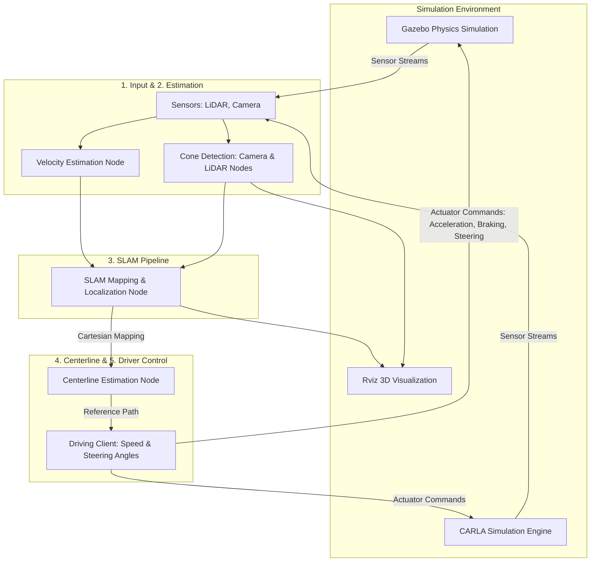
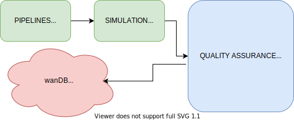
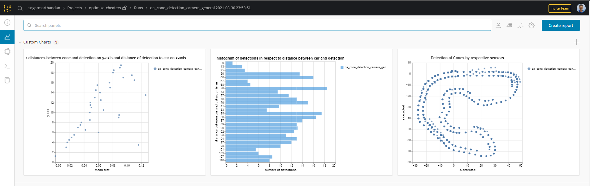
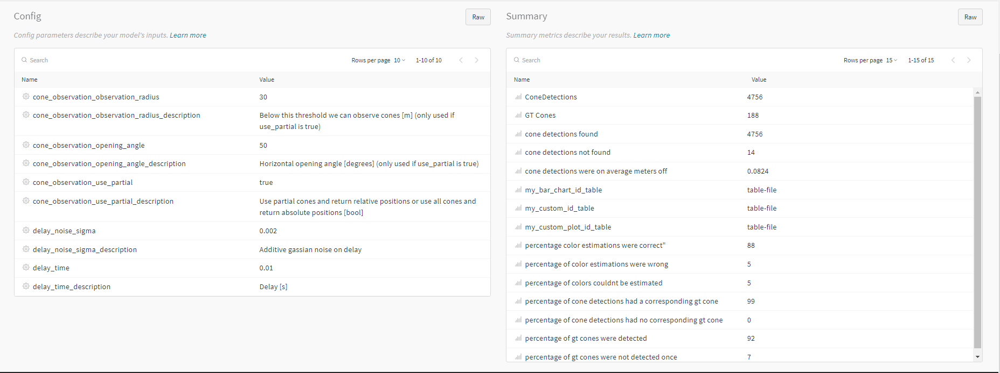
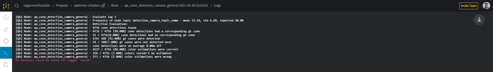
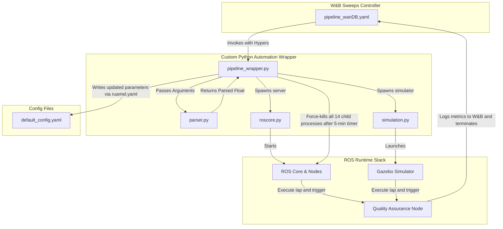
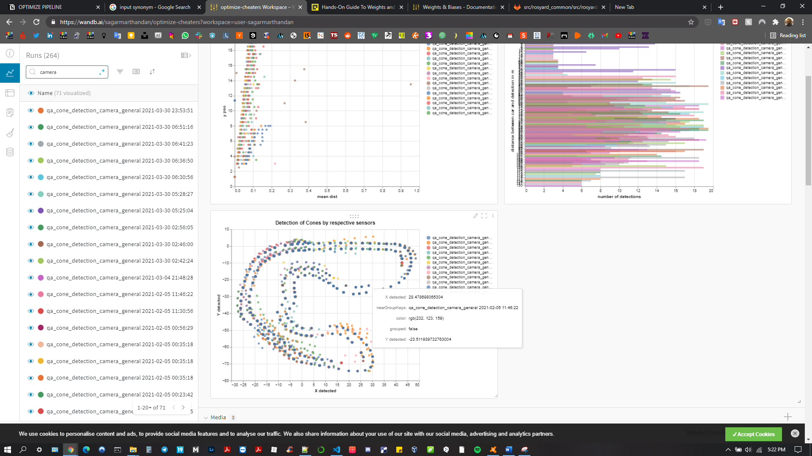

# ROSYARD: Autonomous Driving Simulation and Pipeline Optimization

ROSYARD is an autonomous driving vehicle development project inspired by the AMZ Driverless platform. This project focuses on the design, optimization, and automation of a multi-stage software pipeline that enables simulated vehicles to perceive their environments and navigate tracks autonomously. 

This repository documents the implementation of a Quality Assurance (QA) metrics logging framework using **Weights & Biases (W&B)** and the creation of a custom hyperparameter sweep automation wrapper to optimize sensor and localization parameters in a containerized **ROS / Gazebo** environment.

---

## 🛠️ Tech Stack


* **Languages:** Python, C++, YAML
* **Middleware/OS:** Robot Operating System (ROS Core, rospy, roslaunch)
* **Simulation:** Gazebo Physics Engine, Rviz 3D Visualizer, CARLA Simulator
* **Experiment Tracking:** Weights & Biases (W&B) / wandb
* **Automation:** Custom sweeps wrapper, ruamel.yaml config parser, timer-based process execution
* **Containerization:** Docker Integration

---

## 🏗️ System Architecture

The software architecture of the autonomous car comprises five sequential pipelines communicating via ROS nodes:



### The Three Main Components
1. **ROS Client:** Acts as a data translation layer, feeding simulated or real sensor datasets into simulation clients and driving systems.
2. **CARLA Server/Client:** A high-fidelity simulator wrapped in a server-client architecture.
3. **Driving Client:** A control agent wrapping the simulation to tune steering and throttle response using reinforcement learning techniques.

---

## 🏎️ Abstract Process Flow Chart

Below is the visual process diagram showing how data, nodes, and values interact in each pipeline:


---

## 🧠 Technical Work: Pipeline Optimization

To achieve high-efficiency, crash-free autonomous driving, parameter tuning is executed on the perception (Camera/LiDAR) and SLAM pipelines using a structured pipeline optimization framework.

### 1. Cheat-Based Cone Detection (Ground Truth Simulation)
Since physical vehicle tests are not used at this stage, a "cheat-based" cone detection system leverages simulation-layer ground truth in Gazebo to emulate real-world sensor outputs.
* **Configurations:** Enabled via `src/rosyard_common/config/node_config.yaml`.
* **Nodes Modified:** `detection_camera_node`, `detection_lidar_node`, `detection_camera_qa`, and `detection_lidar_qa`.
* **Tuning Parameters:** `cheat_cone_detection_camera` and `cheat_cone_detection_lidar` sub-parameters (e.g., detection radius, opening angles) located inside `src/rosyard_common/config/node_parameters.yaml`.

### 2. Quality Assurance (QA) Engine
A dedicated QA framework runs in the background of the simulation, analyzing the accuracy of cone detection by comparing estimated cone positions/colors with simulation ground truth.
* **Configurations:** Enabled by setting `enabled: True` in `src/rosyard_common/config/general_config.yaml`.
* **Performance Logs:** Prints real-time statistics in the ROS console:
  * Percentage of detected cones mapped to ground truth cones.
  * False-positive rate (cones detected with no matching ground truth).
  * Missing detection rate (ground truth cones missed by sensors).
  * Color estimation accuracy.

### 3. W&B Experiment Tracking Integration
Weights & Biases (W&B) was integrated into the QA system to log metrics dynamically from the ROS core node execution:



* **Dynamic Ingestion:** Uses `rospy` to dynamically fetch configurations from ROS Parameter Server to populate W&B config (avoiding hardcoded configs).
* **Metric Conversion:** Standard console log statements are piped directly to W&B:
  ```python
  # Console statement:
  self.log("%d / %d (%.2f%%) color estimations were correct" % (color, total, color*100/total))
  
  # Logged to W&B:
  wandb.log({'percentage_color_estimations_correct': color * 100 / total})
  ```
* **Track Visualization:** Plots 2D coordinate points of detected cones using `wandb.plot.scatter` to display simulated vehicle tracks and sensor drift directly on the dashboard.

#### Tracking Dashboard Demos

* **Fig 3: Mean distances, histograms, and path plots recorded per node parameter:**


* **Fig 4: Node parameters mapped to W&B sweep configurations:**


* **Fig 5: Offline logger records:**


---

## 🤖 Sweeps Automation Framework

Because ROS requires launching multiple daemon-like processes concurrently, traditional W&B Sweeps cannot target a single file. An agentic automation wrapper was built in python to execute sweeps recursively across the ROS stack.



### Automation Sequence Workflow

1. **W&B Sweeps Controller:** Reads `pipeline_wanDB.yaml` which defines the search space (e.g., parameter `opening_angle` set from `30` to `40`) and optimization algorithm (Bayes Search).
2. **Parser Interface:** The wrapper script `pipeline_wrapper.py` executes and calls `parser.py` to intercept command-line arguments generated by W&B Sweep and cast them to floats.
3. **YAML Update:** The wrapper uses `ruamel.yaml` to parse `src/rosyard_common/config/default_config.yaml` or `node_parameters.yaml`, modify the parameters, and output it back to disk.
4. **Execution Loop:**
   * Wrapper executes `roscore.py` to spin up ROS Master and `simulation.py` to start Gazebo.
   * Concurrently, 14 node processes run on the ROS stack.
   * A safety timer (4–5 minutes) blocks execution until a lap completes and prevent process lockup.
5. **Metric Reporting:** Once simulation terminates, the QA node pushes execution metrics to W&B dashboards, and the wrapper forcefully terminates all running ROS nodes.

#### W&B Sweep Runs and Metrics Comparisons

* **Fig 6: Multiple camera cone detection runs plotted for comparison:**


* **Fig 7: SLAM map drift comparisons (revealing parameter configurations that cause mapping failures):**


---

## 🚧 Challenges & Implementations

### Tobias's Server-Client GUI Conflict
* **Issue:** Another client-server GUI architecture loaded parameters permanently in memory upon ROS server initialization, blocking dynamic configuration changes mid-run.
* **Resolution:** Bypassed GUI execution, pulling variables purely from the raw `general_config.yaml` config file to maintain automated sweep capability.

### Termination Limbo (Concurrent System Jamming)
* **Issue:** After logging metrics to W&B, child ROS nodes failed to self-terminate, blocking subsequent iterations of the Sweeps automation script.
* **Resolution:** Implemented a hard subprocess execution timer (5 minutes) within the Python automation wrapper to forcefully sweep, clean up, and kill the running process tree before beginning a new run.

---

## 📈 Future Roadmap

* **Transition to Real-World Data:** Integrate DBSCAN (Density-Based Spatial Clustering of Applications with Noise) clustering algorithms to group point cloud outputs from sensors.
* **DBSCAN Hyperparameter Tuning:** Configure W&B sweeps to optimize epsilon ($\epsilon$) and minimum points (`minPts`) for real-world cone grouping.
