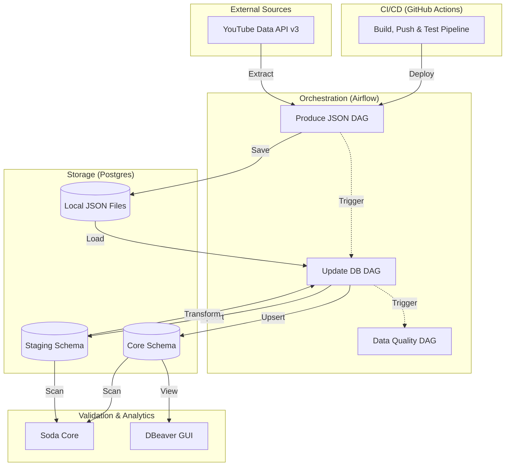
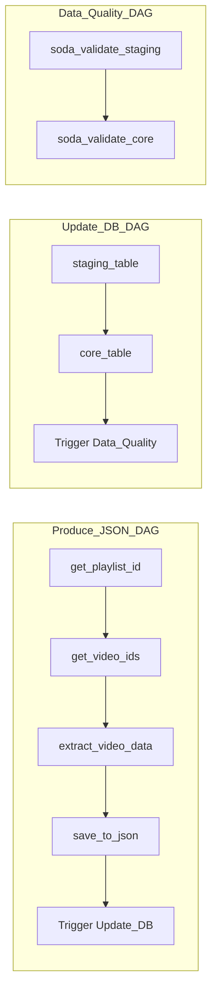

# YouTube E2E: Advanced Data Engineering Pipeline

[](#)
[](#)

A high-performance, containerized ELT (Extract, Load, Transform) pipeline designed to extract channel analytics from the YouTube Data API v3, process them through multiple warehouse layers, and ensure data integrity with automated quality gates.

---

## 🛠️ Technical Ecosystem

| Category            | Technologies                                                                                                                          |
| :------------------ | :------------------------------------------------------------------------------------------------------------------------------------ |
| **Language**        |                                 |
| **Orchestration**   |                      |
| **Database**        |                   |
| **Infrastructure**  |                           |
| **Quality Control** |                                        |
| **Broker/Cache**    |                              |
| **CI/CD**           |  |
| **GUI / IDE**       |                        |
| **Data Source**     |                               |

---

## 🏗️ System Architecture

The pipeline follows a multi-stage process to ensure data is clean, transformed, and validated before reaching the core warehouse layer.



---

## 🧩 Deep Dive: Stage-by-Stage Breakdown

### 1. Extraction Layer (`produce_json`)

The pipeline begins by querying the YouTube Data API. Unlike simple extraction, this stage handles complexity through:

- **Uploads Discovery**: Dynamically fetches the 'uploads' playlist ID for any given channel handle.
- **Paginated Retrieval**: Iteratively collects every video ID from the channel, bypassing API result limits.
- **Efficient Batching**: Queries video statistics in batches of 50 (the API maximum) to minimize latency and quota usage.
- **Persistence**: Serializes the raw response into timestamped JSON files for auditability.

### 2. Staging Layer (`update_db` -> `staging_table`)

This stage synchronizes the raw JSON data with the `staging.yt_api` table.

- **Smart Synchronization**: Implements a full Upsert (Update or Insert) logic.
- **Drift Management**: Automatically identifies and deletes records in the database that are no longer present in the source (e.g., deleted or private videos).
- **Schema Enforcement**: Ensures the `staging` schema and table structures are consistent before every run.

### 3. Core Warehouse Layer (`update_db` -> `core_table`)

Data is moved from Staging to Core after applying business transformations:

- **Duration Normalization**: Converts ISO 8601 duration strings (e.g., `PT1H2M10S`) into standard PostgreSQL `TIME` objects.
- **Video Classification**: Adds a logic-based `Video_Type` column, categorizing content as **'Shorts'** (≤ 60s) or **'Normal'** (> 60s).
- **History Preservation**: Maintains a clean, transformed mirror of the staging data, optimized for downstream BI tools like DBeaver.

### 4. Data Quality Layer (`data_quality`)

Automated validation using **Soda Core** ensures the warehouse remains a "single source of truth":

- **Integrity Checks**: Validates that `Video_ID` is neither null nor duplicated.
- **Business Logic Checks**: Verifies that metrics make sense (e.g., `Likes_Count` or `Comments_Count` can never exceed `Video_Views`).
- **Layered Validation**: Independently scans both the Staging and Core schemas.

### 5. CI/CD Layer (GitHub Actions)

The project includes a robust **Continuous Integration & Deployment** pipeline:

- **Automated Builds**: Docker images are automatically built and pushed to DockerHub upon changes to core dependencies or the Dockerfile.
- **Automated Testing**: Every push triggers a suite of **Unit, Integration, and E2E DAG tests** within a containerized environment.
- **Secrets Management**: Leverages GitHub Secrets and Variables to securely inject API keys and database credentials into the testing environment.

---

## 🚦 Airflow DAG Workflow



---

## ⚙️ Environment Configuration

To run this project, you must configure a `.env` file in the root directory.

### 🔑 Essential Variables

| Variable                 | Description                       | Example                            |
| :----------------------- | :-------------------------------- | :--------------------------------- |
| `API_KEY`                | YouTube Data API v3 Key           | `AIzaSy...`                        |
| `CHANNEL_HANDLE`         | The @handle of the target channel | `@MrBeast`                         |
| `FERNET_KEY`             | Encryption key for Airflow        | `Generate via cryptography.fernet` |
| `AIRFLOW_UID`            | System User ID for Docker         | `50000`                            |
| `POSTGRES_CONN_PASSWORD` | Master Postgres Password          | `your_secure_pw`                   |
| `ELT_DATABASE_NAME`      | Target Warehouse Database         | `elt_db`                           |
| `ELT_DATABASE_USERNAME`  | Warehouse User                    | `yt_api_user`                      |

> [!IMPORTANT]
> For **CI/CD**, these variables must also be added to your **GitHub Repository Secrets and Variables** to allow the automated tests to run.

---

## 🚀 Installation & Setup

### 1. Prerequisites

- **Docker & Docker Compose**: Ensure the daemon is running.
- **Python 3.10+**: For local testing and linting.
- **DBeaver**: For external data visualization.
- **YouTube API Access**: Enabled via [Google Cloud Console](https://console.cloud.google.com/).

### 2. Clone & Prepare

```bash
git clone https://github.com/SagarMarthandan/Youtube_E2E_DE.git
cd Youtube_E2E_DE
cp .env.example .env # Fill in your keys
```

### 3. Initialize & Launch

```bash
# 1. Initialize Airflow (Creates DB, users, and directories)
docker-compose up airflow-init

# 2. Launch the ecosystem
docker-compose up -d
```

### 4. Access the Pipeline

- **Airflow UI**: [http://localhost:8080](http://localhost:8080) (Default: `airflow`/`airflow1234`)
- **Database Visualization**: Open **DBeaver**, connect using `localhost:5432`, DB: `elt_db`, User: `yt_api_user`. You can now query the `staging` and `core` schemas externally.

---

## 📈 Future Roadmap

- [ ] Integration with AWS S3 for long-term JSON archiving.
- [ ] Dashboard implementation using Streamlit or PowerBI.
- [ ] Slack/Discord notifications on Data Quality failure.

---


---------------------------------------------------------------------------------------